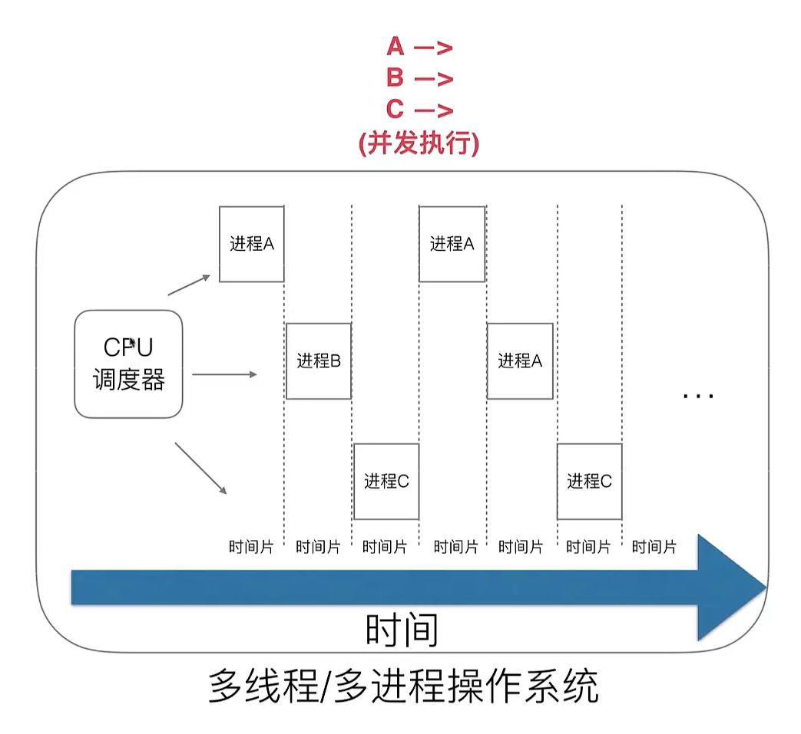
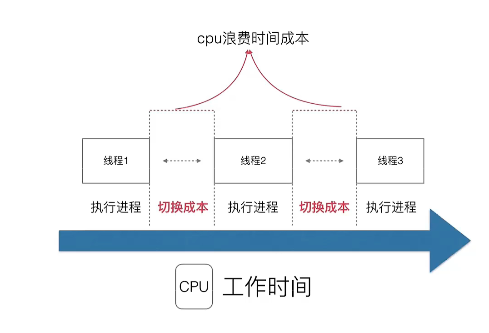
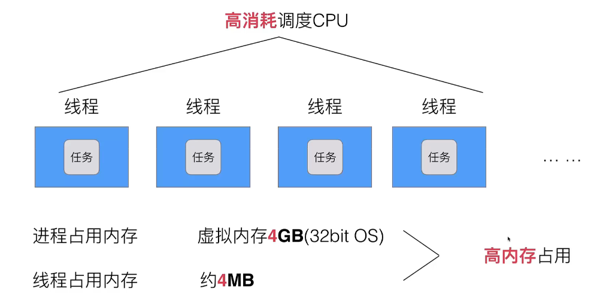
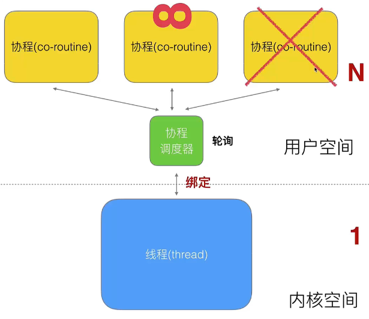
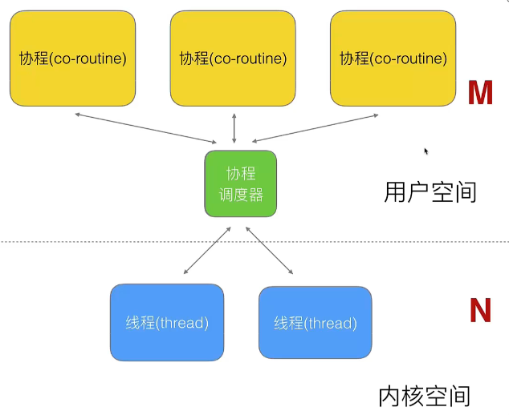
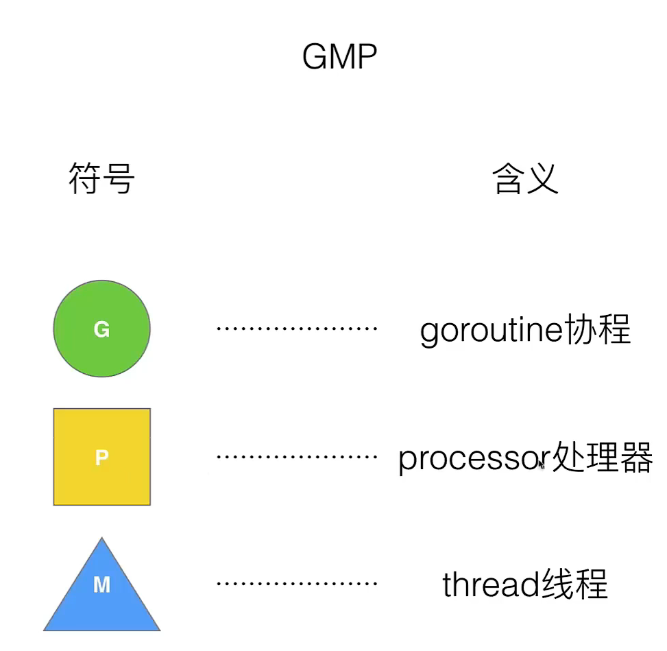
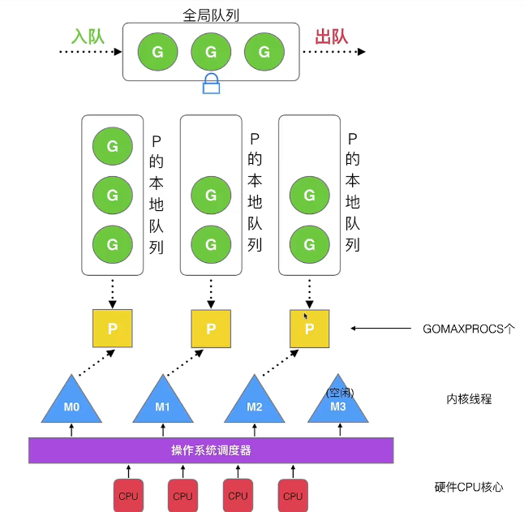
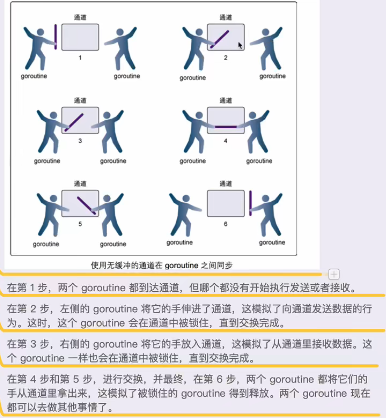
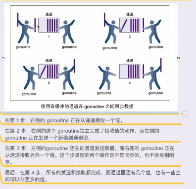

[Go语言101 - Go语言101（通俗版Go白皮书） (go101.org)](https://gfw.go101.org/article/101.html)

# Go

## Go命令

上面提到的三个`go`子命令（`go run`、`go build`和`go install`） 将只会输出代码语法错误。它们不会输出可能的代码逻辑错误（即警告）。 `go vet`子命令可以用来检查可能的代码逻辑错误（即警告）。

我们可以（并且应该常常）使用`go fmt`子命令来用同一种代码风格格式化Go代码。

我们可以使用`go test`子命令来运行单元和基准测试用例。

我们可以使用`go doc`子命令来（在终端中）查看Go代码库包的文档。

强烈推荐让你的Go项目支持Go模块特性来简化依赖管理。对一个支持Go模块特性的项目：

- `go mod init example.com/myproject`命令可以用来在当前目录中生成一个`go.mod`文件。 当前目录将被视为一个名为`example.com/myproject`的模块（即当前项目）的根目录。 此`go.mod`文件将被用来记录当前项目需要的依赖模块和版本信息。 我们可以手动编辑或者使用`go`子命令来修改此文件。

- `go mod tidy`命令用来通过扫描当前项目中的所有代码来添加未被记录的依赖至`go.mod`文件或从`go.mod`文件中删除不再被使用的依赖。

- `go get`命令用拉添加、升级、降级或者删除单个依赖。此命令不如`go mod tidy`命令常用。

  

  官方文档：[Command go - The Go Programming Language (google.cn)](https://golang.google.cn/cmd/go/)

## 环境安装

GOROOT 源码包所在路径

GOPATH 开发者Go项目默认路径

### 检测开发环境

go version go --help

## 简单示例

```go
package main // 指定当前源文件所在的包名

import "math/rand" // 引入一个标准库包

const MaxRand = 16 // 声明一个有名整型常量
```

## 基本语法

### 变量

#### 局部变量

```go
var a int
var b int = 100
var c = 100
d := 100
```

#### 全局变量

不支持局部声明的方法四

#### 多变量

```go
var a,b int = 100,200
var c,d = 100,"abc"
var{
    e int = 100
    f bool = true
}
```

### 常量

```go
const a int = 10
const{
    a = 10
    b = 20
}
//iota 必须和const同时使用，第一行代表0，自增
const{
    beijing = iota + 10 //iota 0
    shanghai			//iota 1
    shenzhen			//iota 2
}
```

### 函数

#### 多返回值

```go
func f1(a string, b int)(int,int){
    fmt.Println(a)
    fmt.Println(b)
	return 666,777
}
func f2(a string, b int)(r1 int,r2 int){
    fmt.Println(a)
    fmt.Println(b)
    //默认值 0 
    fmt.Println(r1)
    fmt.Println(r2)

    r1 = 1000
    r2 = 2000
	return r1,r2
}
```

#### main函数和init函数

##### 执行顺序

main

import pkg1 - > 	pkg 1

const					   import pkg2 -> 	pkg2

var						   const

init()					 	var

main()				  	init()

Exit

```go
package pkg1
func LibTest(){
    //公有函数
}
func init(){
	//默认执行
}
```

#### import导入方式

```go
import _"fmt"	//匿名导入，仅调用fmt.init()，无法使用其他方法
import aa"fmt"	//别名调用
import ."fmt"	//可以直接使用fmt中api
```

### 指针

&：传参使用，传入参数的内存地址

*：操作地址的值 

```go
func changeValue(p *int){
    //p 是a的地址
    //*p 操作地址的值
    *p = 10;
}
func main(){
    var a int = 1;
    changeValue(&a);
    
    //二级指针
    var a = 10;
    var p *int;
    p = &a;
    var pp **int;
    pp = &p;
}

```

### defer

函数最后执行（在return之后执行），defer先进后出（栈）

```go
func main(){
    defer fmt.Println("main end")
    defer fmt.Println("main end2")
    //main end2
    //main end
}
```

### 切片slice

#### 数组

数组长度固定，传参过程是值传递

```go
func printArray(array [4]int){
	for index,value := range array{
    	fmt.Println(index,value);
	}
}
func main(){
	var array [10]int
	array2 := [10]int{1,2,3,4}	//后面默认值0
	for i := 0;i<len(array);i++{
    	fmt.Println(array[i]);
	}
	for index,value := range array2{
    	fmt.Println(index,value);
	}
}

```

#### slice（动态数组）

动态数组，引用类型，传参过程是引用传递引用传递

```go
func printArray(array []int){
	for index,value := range array{
    	fmt.Println(index,value);
	}
    array[0] = 100;
}
func main() {
	array := []int{1, 2, 3, 4}
	fmt.Printf("array type is %T\n", array)
	printArray(array)
	for _, value := range array {
		fmt.Println("value", value)
	}
}
```

##### 声明方式

```go
func main() {	
	slice1 := []int{1, 2, 3}

	var slice2 []int		//此时slice2是nil
	slice2 = make([]int, 3)	//必须分配空间才能使用

	var slice3 []int = make([]int,3);

	slice4 := make([]int,3);

	fmt.Printf("len = %d,slice = %v\n", len(slice1), slice1)
	fmt.Printf("len = %d,slice = %v\n", len(slice2), slice2)
	fmt.Printf("len = %d,slice = %v\n", len(slice3), slice3)
	fmt.Printf("len = %d,slice = %v\n", len(slice4), slice4)
}
```

##### 使用方式

容量追加

```go
func main() {
	var numbers = make([]int, 3, 5)
	fmt.Printf("len = %d,cap = %d,slice = %v\n", len(numbers), cap(numbers), numbers)

	//追加元素
	numbers = append(numbers, 1);
	fmt.Printf("len = %d,cap = %d,slice = %v\n", len(numbers), cap(numbers), numbers)

	numbers = append(numbers, 2);
	fmt.Printf("len = %d,cap = %d,slice = %v\n", len(numbers), cap(numbers), numbers)

	//追加元素，同时开辟初始化的（5）空间
	numbers = append(numbers, 3);
	fmt.Printf("len = %d,cap = %d,slice = %v\n", len(numbers), cap(numbers), numbers)

	//不声明cap, len 即是 cap值
	var numbers2 = make([]int,3);
	fmt.Printf("len = %d,cap = %d,slice = %v\n", len(numbers2), cap(numbers2), numbers2)
}

//输出结果
len = 3,cap = 5,slice = [0 0 0]
len = 4,cap = 5,slice = [0 0 0 1]
len = 5,cap = 5,slice = [0 0 0 1 2]
len = 6,cap = 10,slice = [0 0 0 1 2 3]
len = 3,cap = 3,slice = [0 0 0]
```

容量截取

copy函数会执行深拷贝，使用新的内存空间

```go
func main() {
	var numbers = []int{1,2,3};
	fmt.Printf("len = %d,cap = %d,slice = %v\n", len(numbers), cap(numbers), numbers)

	numbers2 := numbers[0:2];
	fmt.Printf("len = %d,cap = %d,slice = %v\n", len(numbers2), cap(numbers2), numbers2)
	
	numbers3 := make([]int,3);
	copy(numbers3,numbers);
	fmt.Printf("len = %d,cap = %d,slice = %v\n", len(numbers3), cap(numbers3), numbers3)

	fmt.Println(&numbers[0]);
	fmt.Println(&numbers2[0]);
	fmt.Println(&numbers3[0]);
}
//输出结果
len = 3,cap = 3,slice = [1 2 3]
len = 2,cap = 3,slice = [1 2]
len = 3,cap = 3,slice = [1 2 3]
0xc00000e150
0xc00000e150
0xc00000e168
```

### map

引用类型

##### 声明方式

```go
func main() {
	var map1 map[string]string;
	if map1 == nil {
		fmt.Println("map1 是空的")
	}

	map1 = make(map[string]string, 10)
	map1["1"] = "1"
	map1["2"] = "2"
	map1["3"] = "3"
	fmt.Println(map1)

	map2 := make(map[string]int);
	map2["1"] = 1;
	map2["2"] = 2;
	map2["3"] = 3;
	fmt.Println(map2)

	map3 := map[string]int{
		"1":1,
		"2":2,
		"3":3,
	}
	fmt.Printf("len = %d,map = %v\n", len(map3), map3)
}
//输出
map1 是空的
map[1:1 2:2 3:3]
map[1:1 2:2 3:3]
len = 3,slice = map[1:1 2:2 3:3]
```

##### 使用方式

map是引用传递

```go
func main() {
	var cityMap = make(map[string]string);
	cityMap["China"] = "beijing";
	cityMap["Japan"] = "tokyo";
	cityMap["USA"] = "NEWYORK";
	fmt.Printf("len = %d,map = %v\n", len(cityMap), cityMap)
	//遍历
	for key, value := range cityMap{
		fmt.Println(key,value);
	}
	//删除
	delete(cityMap,"China");
	fmt.Printf("len = %d,map = %v\n", len(cityMap), cityMap)

	//修改
	cityMap["USA"] = "dc";
	fmt.Printf("len = %d,map = %v\n", len(cityMap), cityMap)
}
//输出
len = 3,map = map[China:beijing Japan:tokyo USA:NEWYORK]
China beijing
Japan tokyo
USA NEWYORK
len = 2,map = map[Japan:tokyo USA:NEWYORK]
len = 2,map = map[Japan:tokyo USA:dc]
```

### 结构体

struct是值类型，值传递

```go
type Book struct {
	title string
	price int
}

func changeBook(book *Book)  {
	book.title = "R";
}
func main() {
	var book1 Book;
	book1.title = "T";
	book1.price = 1;
	fmt.Println(book1);
	changeBook(&book1)
	fmt.Println(book1);
}
//输出
{T 1}
{R 1}
```

### 面向对象

#### 封装

其他包访问权限 ： 首字母大写 公有，小写 私有

```go
//其他包访问权限 ： 首字母大写 公有，小写 私有
type Hero struct {
	name string
	level int
}
//func (this Hero) GetName()  {
//	fmt.Println(this.name);
//}
//func (this Hero) SetName(newName string)  {
//	//this 是一个副本
//	this.name = newName;
//}

func (this *Hero) GetName()  {
	fmt.Println(this.name);
}
func (this *Hero) SetName(newName string)  {
	this.name = newName;
}

func main() {
	var hero = Hero{name: "A",level: 1};
	hero.name = "C"
	hero.GetName();
	hero.SetName("B")
	hero.GetName();
}
//输出
C
B
```

#### 继承

Go语音设计者的强一致性，要给一个结构体类型赋值时，如果要指定变量名赋值，需要都指定变量名，否则都不指定，不可以混合使用，有的指定有的不指定

```go

//其他包访问权限 ： 首字母大写 公有，小写 私有
type Hero struct {
	Name string
	Level int
}

func (this *Hero) GetName()  {
	fmt.Println(this.Name);
}
func (this *Hero) SetName(newName string)  {
	this.Name = newName;
}

type Hero1 struct {
	Hero	//继承Hero
	skillId int
}

func (this *Hero1)GetName()  {
	fmt.Println("hero1Name",this.Name);
}
func (this *Hero1)UseSkill()  {
	fmt.Println("skillId",this.skillId);
}

func main() {
	var hero = Hero{Name: "A",Level: 1};
	hero.GetName();
	hero.SetName("B")
	hero.GetName();

	var hero1 = Hero1{Hero{ "hero1", 2},0};
    //编译错误 Go语音设计者的强一致性，要给一个结构体类型赋值时，如果要指定变量名赋值，需要都指定变量名，否则都不指定，不可以混合使用，有的指定有的不指定
    //var hero2 = Hero1{Hero{Name:"a",Level: 3},skillId:1}; 
	hero1.GetName();
	hero1.SetName("hero2");
	hero1.GetName();
	hero1.UseSkill();
}
//输出
A
B
hero1Name hero1
hero1Name hero2
skillId 0

```

#### 多态

有一个父类（接口）；有子类（实现父类全部接口方法）；父类类型的变量（指针）指向子类的具体数据变量

```go
//interface 本质是一个指针
type AnimalIF interface {
	Sleep()
	GetColor() string
	GetType() string
}

//具体的类 实现接口所有的函数时即继承了接口
type Cat struct {
	color string
}

func (this *Cat) Sleep() {
	fmt.Println("Cat is Sleep")
}

func (this *Cat) GetColor() string {
	return this.color
}
func (this *Cat) GetType() string {
	return "Cat"
}

type Dog struct {
	color string
}

func (this *Dog) Sleep() {
	fmt.Println("Dog is Sleep")
}

func (this *Dog) GetColor() string {
	return this.color
}
func (this *Dog) GetType() string {
	return "Dog"
}

func showAnimal(animal AnimalIF)  {
	animal.Sleep();//多态
	fmt.Println("Color",animal.GetColor());
	fmt.Println("kind",animal.GetType());
}

func main() {
	var animal AnimalIF;
	animal = &Cat{"Green"};
	animal.Sleep();

	animal = &Dog{"Yellow"};
	animal.Sleep()

	cat := Cat{"Red"};
	dog := Dog{"Blue"};
	showAnimal(&cat)
	showAnimal(&dog)
}
//输出
Cat is Sleep
Dog is Sleep
Cat is Sleep
Color Red
kind Cat
Dog is Sleep
Color Blue
kind Dog
```

### interface

//本质是一个指针

#### 万能类型

```go
interface{}
//1 这是一个空接口
//2 int string float32 struct 都实现了空接口
//3 可以用interface{}类型 引用 任意数据类型
```

#### 类型断言

```go

func  myFunc(arg interface{})  {
	//interface{} 如何区分 引用的数据类型
	//interface{} 提供了断言机制
	var value,ok = arg.(int);
	if !ok{
		fmt.Println("arg is not int")
        fmt.Println(arg);
	}else {
		fmt.Println("arg is int")
		fmt.Println(value);
	}
}

type Book struct {
	title string
}

func main() {
	var book = Book{"123"};
	myFunc(book);
	myFunc(100);
	myFunc("book");
	myFunc(3.14);
}
//输出
arg is not int
{123}
arg is int
100
arg is not int
book
arg is not int
3.14
```

### 反射

#### 变量结构

pair{type,value}

type:	static type(int、string);	concrete type(interface所指向的具体数据类型)

```go
func main() {
	//pair<statictype:string,value:"a">
	var a string = "a";

	//pair<type:string,value:"a">
	var allType interface{}
	allType = a;

	str,_ := allType.(string)
	fmt.Println(str);
	fmt.Println(allType);

	//pair<type:*os.File,value:文件描述>
	_,err:=os.OpenFile("/dev/tty",os.O_RDWR,0);
	if err != nil{
		fmt.Println("open file error",err)
		return
	}
}
//输出
a
a
open file error open /dev/tty: The system cannot find the path specified.
```

```go
type Reader interface {
	ReadBook()
}
type Writter interface {
	WriteBook()
}
type Book struct {
}

func (this *Book) ReadBook() {
	fmt.Println("Read")
}
func (this *Book) WriteBook() {
	fmt.Println("Write")
}

func main() {
	//pair<type:Book,value:book{}地址>
	b := &Book{}
	//pair<type:,value:>
	var r Reader
	//pair<type:Book,value:book{}地址>
	r = b
	r.ReadBook()
	//pair<type:,value:>
	var w Writter
	//pair<type:Book,value:book{}地址>
	w = r.(Writter)
	w.WriteBook();
}
//输出
Read
Write
```

#### reflect包

两个API:	ValueOf	TypeOf

注意：Call2不会被识别为User的方法

```go

func ReflectNum(arg interface{}) {
	fmt.Println("type:", reflect.TypeOf(arg))
	fmt.Println("value:", reflect.ValueOf(arg))
}

type User struct {
	Name string
	Age  int
}

func (this User) Call() {
	fmt.Println("user is called")
	fmt.Printf("%v\n", this)
}
func (this *User) Call2() {
	fmt.Println("user is called")
	fmt.Printf("%v\n", this)
}
func main() {
	var num float64 = 1.23
	ReflectNum(num)

	user := User{"user", 1}
	DoFiledAndMethod(user)

}

func DoFiledAndMethod(input interface{}) {
	//获取inputtype
	inputType := reflect.TypeOf(input)
	fmt.Println("type:", inputType)

	//获取inputvalue
	inputValue := reflect.ValueOf(input)
	fmt.Println("value:", inputValue)

	//通过type获取里面的字段
	//1.通过type得到NumField	2.得到每个field,数据类型	3.得到field的value
	for i := 0; i < inputType.NumField(); i++ {
		field := inputType.Field(i)
		value := inputValue.Field(i).Interface()
		fmt.Printf("%s:%v = %v\n", field.Name, field.Type, value)
	}

	fmt.Println("==========")
	fmt.Println(inputType.NumMethod())

	//通过type获取里面的方法
	for i := 0; i < inputType.NumMethod(); i++ {
		field := inputType.Method(i)
		//value := inputValue.Method(i).Interface();
		fmt.Printf("%s:%v \n", field.Name, field.Type)
	}
}
//输出
type: float64
value: 1.23
type: main.User
value: {user 1}
Name:string = user
Age:int = 1
==========
1
Call:func(main.User) 
```

### 结构体标签

```go
type User struct {
	Name string `info:"name" doc:"myName"`
	Age  int    `info:"sex"`
}

func finTag(str interface{}) {
	t := reflect.TypeOf(str).Elem()
	for i := 0; i < t.NumField(); i++ {
		taginfo := t.Field(i).Tag.Get("info")
		tagdoc := t.Field(i).Tag.Get("doc")
		fmt.Println("info", taginfo)
		fmt.Println("doc", tagdoc)

	}
}

func main() {
	var user User
	finTag(&user)
}
//输出
info name
doc myName
info sex
doc 
```

#### 结构体标签在json中的应用

1、json编解码

2、orm映射关系

```go
type Movie struct {
	Title string `json:"title"`
	Price int    `json:"rmb"`
}

func main() {
	movie := Movie{"功夫", 40}
	//结构体转jsonstr
	str, err := json.Marshal(movie)
	if err != nil {
		fmt.Println("json error", err)
		return
	}
	fmt.Printf("jsonstr = %s\n",str)

	//jsonstr 转 结构体
	movie2 := Movie{};
	err = json.Unmarshal(str,&movie2);
	if err != nil {
		fmt.Println("json error", err)
		return
	}
	fmt.Printf("%v",movie2);
}
//输出
jsonstr = {"title":"功夫","rmb":40}
{功夫 40}
```

## golang高阶

cpu调度



cpu工作时间



进程/线程的数量越多，切换成本越大，cpu执行程序时间越少

多线程 随着 同步竞争 开发设计变得越来越复杂



### 携程调度器

1、N比1方式 易阻塞



2、M比N方式



### Golang对线程的处理


#### 早期调度器处理


缺点：

​	1、激烈的竞争，创建、销毁、调度G都需要每个M获取锁

​	2、M转移G会造成延迟和额外的系统负载

​	3、系统调用（CPU在M之间切换）导致频繁的线程阻塞和取消阻塞操作增加了系统开销

#### GMP调度器

##### GMP含义



##### GMP调度器处理



#### 调度器的设计策略

##### 复用线程

​	1、work stealing机制

​		空闲线程偷取G执行

​	2、hand off机制

​		将P与阻塞M分离，创建/唤醒一个新的M绑定P

##### 利用并行

GOMAXPROCS限定P的个数	=	CPU核数/2

##### 抢占

co-routine  等待主动释放

go-routine 10ms 抢占

##### 全局G队列

G队列

### goroutine

#### 携程创建

```go
//子goroutine
func newTask()  {
	var i = 0;
	for{
		i++
		fmt.Printf("new goroutine : i = %d\n",i);
		time.Sleep(1 * time.Second);
	}
}

//主goroutine
func main() {
	//创建一个go程 去执行newTask()
	go newTask();

	//fmt.Println("main goroutine exit")
	var i = 0;
	for{
		i++
		fmt.Printf("main goroutine : i = %d\n",i)
		time.Sleep(1 * time.Second);
	}
}
//输出
main goroutine : i = 1
new goroutine : i = 1
main goroutine : i = 2
new goroutine : i = 2
new goroutine : i = 3
main goroutine : i = 3
new goroutine : i = 4
main goroutine : i = 4
main goroutine : i = 5
```

#### 匿名方式

```go
//主goroutine
func main() {
	go func() {
		defer fmt.Println("A.defer")
		func() {
			defer fmt.Println("B.defer")
			fmt.Println("B")
		}()
		fmt.Println("A")
	}()
	//死循环
	for{
		time.Sleep(1 * time.Second);
	}
}
//输出
B
B.defer
A
A.defer
```

#### 携程返回

```go
func main() {
	go func() {
		defer fmt.Println("A.defer")
		////主函数退出go携程
		//return;
		func() {
			defer fmt.Println("B.defer")
			//在子函数退出go 携程
			runtime.Goexit();
			fmt.Println("B")
		}()
		fmt.Println("A")
	}()
	//死循环
	for{
		time.Sleep(1 * time.Second);
	}
}
//输出
B.defer
A.defer
```

#### 携程带参

```go
//主goroutine 携程带参
func main() {
	go func(a int, b int) bool {
		fmt.Println("a = ", a, "b =", b);
		return true
	}(10, 20)

	for{
		time.Sleep(1 * time.Second);
	}
}
//输出
a =  10 b = 20
```

### channel

#### 作用

goroutine之间进行通讯

#### 定义

```go
make(chan type)
make(chan type,capacity)
```

#### 使用

发送value到channel：channel <- value

接受并将其丢弃：<-channel

接受数据赋值：x  := <-channel

接受赋值同时检查通道是否关闭：x,ok := <-channel

```go
//两个gotoutine会互相等待，知道channel完成数据传输
func main(){
    c := make(chan int);
    go func(){
        defer fmt.Println("goroutine 结束")
        fmt.Println("goroutine 正在运行...")
        c <- 666	//将666发给c
    }()
    var num = <-c	//从c中接受数据
    fmt.Println("num = ",num)
    fmt.Println("main goroutine 结束")
}
//输出
goroutine 正在运行...
goroutine 结束
num =  666
main goroutine 结束
```

#### 无缓冲的channel



#### 有缓冲的channel



channel空间充足，子goroutine直接结束，否则会等待主goroutine取值

```go
//主goroutine
func main(){
	c := make(chan int,3);
	fmt.Println(len(c),cap(c));
	go func(){
		defer fmt.Println("goroutine 结束")
		for i:=0;i<4;i++{
			c <- i
			fmt.Println("子go running...",i,len(c),cap(c));
		}
	}()
	time.Sleep(2 * time.Second);
	for i:=0;i<4;i++ {
		var num = <-c	//从c中接受数据
		fmt.Println("num = ",num)
	}
	time.Sleep(2 * time.Second);
	fmt.Println("main goroutine 结束")
}
//输出
0 3
子go running... 0 1 3
子go running... 1 2 3
子go running... 2 3 3
num =  0
num =  1
num =  2
num =  3
子go running... 3 3 3
goroutine 结束
main goroutine 结束
```

#### 关闭的特点

1、确定没有数据需要发送即可关闭channel

2、关闭channel后不能再发送数据，否则返回panic错误

3、关闭channel后可以继续取数据

4、对你nil channel，无论首发都会阻塞

```go
//主goroutine
func main() {
	c := make(chan int)
	fmt.Println(len(c), cap(c))
	go func() {
		defer fmt.Println("goroutine 结束")
		for i := 0; i < 5; i++ {
			c <- i
		}
		close(c)
	}()
	time.Sleep(2 * time.Second)
	for {
		if data, ok := <-c; ok {
			fmt.Println("data=", data)
		} else {
			break
		}
	}
	fmt.Println("Main go end")
}
//输出
0 0
data= 0
data= 1
data= 2
data= 3
goroutine 结束
data= 4
Main go end
```

#### channel和range

```go

//主goroutine
func main() {
	c := make(chan int)
	fmt.Println(len(c), cap(c))
	go func() {
		defer fmt.Println("goroutine 结束")
		for i := 0; i < 5; i++ {
			c <- i
		}
		close(c)
	}()
	for data := range c{
		fmt.Println("data=", data)
	}
	fmt.Println("Main go end")
}
//输出
0 0
data= 0
data= 1
data= 2
data= 3
data= 4
Main go end
```

#### channel和select

单流程下一个go只能监控一个channel的状态，select可以完成监控多个channel的状态

```go
select{
    case <- chan1:
    //chan1是否可读
    case chan2 <-:
    //chan2是否可写
    default:
}
```

```go
func fab(c, quit chan int) {
	x, y := 1, 1
	for {
		select {
		case c <- x:
			z := y;
			y = x + y
			x = z;
		case <-quit:
			return
		}
	}
}

//主goroutine
func main() {
	c := make(chan int)
	quit := make(chan int)
	go func() {
		for i := 0; i < 8; i++ {
			fmt.Println(<-c)
		}
		quit <- 0
	}()

	fab(c, quit)
	fmt.Println("Main go end")
}
//输出
1
1
2
3
5
8
13
21
Main go end
```

## GoModules

### 设计目的

1、依赖管理问题

2、淘汰GOPATH模式

3、统一其他依赖管理工具

### GOPATH工作模式

弊端：

​	没有版本控制概念

​	无法同步一致第三方版本号

​	无法制定当前项目引用的第三方版本号

### GoModules工作模式

#### go mod命令

go mod init	生成go.mod文件

go mod download	下载go.mod中指明的依赖

go mod tidy	整理现有依赖

go mod vendor	导出项目所有依赖到vendor目录

go mod graph	查看依赖结构

go mod edit	编辑go.mod文件

go mod verify	校验一个模块是否被篡改过

go mod why	查看为什么需要依赖某模块

#### go mod环境变量

##### GO111MODULE

​	Go modules的开关，1.11版本后Go才有Go modules工作模式。

参数：

​	auto:默认值，有go.mod文件启用

​	on:启用

​	off:不启用

命令：

​	go env -w GO111MODULE=on

##### GOPROXY

​	Go模块代理，拉去模块的镜像站点

默认值：https://proxy.golang.org,direct	国内访问不了，需要设置代理

阿里云：

​	https://mirrors.aliyun.com/goproxy/

七牛云

​	https://goproxy.cn,direct

命令：

​	go env -w GOPROXY=https://goproxy.cn,direct

##### GOSUMDB

​	用于拉去模块版本时保证版本未经过篡改

默认值：sum.golang.org，国内无法访问，可以通过设置GOPROXY来解决

参数：off可以关闭校验，不建议使用

##### GONOPROXY/GONOSUMDB/GOPRIVATE

项目使用了私有模块，GOPRIVATE设置好后会自动覆盖另外两项。在私有库下载可以不进行校验

#### 初始化项目

1、开启Go Modules

​	go env -w GO111MODULE=ON

2、创建项目目录

​	mkdir -p $HOME/xxx/xxx

​	cd $HOME/xxx/xxx

3、执行初始化

​	go mod init xxxx(模块名称)

4、修改模块依赖关系

​	go mod edit -replace=xxxx1=xxxx2


