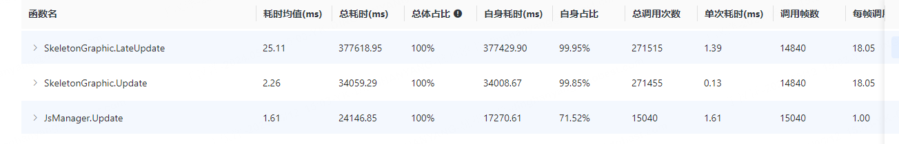

[toc]

# Unity性能优化总结

## 1、内存

### 资源内存

#### 纹理

##### 格式

纹理压缩格式的内存计算方式:
		menory = width * height * 每像素对应的字节大小，Astc压缩每个色块大小固定为16byte，以一张1024X1024的贴图为例：
		RGBA32 Bit：表示每个像素占用32bit 4byte，内存大小 = 1024 X 1024 X 4 = 4M
		RGBA16 Bit：表示每个像素占用16bit 2byte，内存大小 = 1024 X 1024 X 2 = 2M
		RGB ETC1 4Bit：表示每个像素占用4bit 0.5byte，内存大小 = 1024 X 1024 X 0.5= 0.5M
		RGBA ETC2 8Bit：表示每个像素占用8bit 1byte，内存大小 = 1024 X 1024 X 1= 1M
		RGBA PVRTC 4Bit：表示每个像素占用4bit 0.5byte，内存大小 = 1024 X 1024 X 0.5= 0.5M
		RGBA ASTC 4X4 block：表示每个像素占用16byte / 4x4，内存大小 = 1024 X 1024 X 1= 1M
		RGBA ASTC 6X6 block：表示每个像素占用16byte / 6x6，内存大小 = 1024 X 1024 X 0.45= 0.45M
		RGBA ASTC 8X8 block：表示每个像素占用16byte / 8x8，内存大小 = 1024 X 1024 X 0.25= 0.25M

图片尺寸：
  ETC1(不支持透明通道)、ETC2(支持透明通道) 要求图片宽和高可以不相等但是必须被4整除
  PVRTC压缩格式要求图片的宽高必须相等并且是2的整数次幂，例如512X512，如果是512X1024那么就无法压缩了 ；

硬件限制：
		ETC2只支持OpenGL ES 3.0以上的Android手机（大概2013年以后的手机都支持,不用使用ETC1-不用通道分离）
		ASTC只支持苹果A8以后的设备，iPhone 6 及以上的手机（大概2014年以后的手机都支持）
		IOS平台使用ASTC6*6 (不支持苹果5,iphone6以后都支持 支持透明通道)压缩率比PVRT4 bit 好，硬件限制弱

最佳实践：
		一般情况下：美术要求清晰使用：RGBA ASTC 4X4 block；无要求：RGBA ASTC 6X6 block

##### 分辨率

纹理尺寸越大，则内存占用越大，尽可能降低纹理尺寸。如果512x512的纹理对显示效果已经够用，就不要使用1024x024。
Sprite的9宫格，可以放大中间区域近似的图片

##### Read/Write

开启该选项**会使纹理内存增大一倍（会增加一份拷贝在内存里）**

##### Mipmap

开启该选项能有效的降低渲染带宽压力，提升渲染效率，但是同时会将纹理内存提升1.33倍（简单说内存换GPU，3D游戏中会经常使用到）

##### 题外话

使用代码创建Sprite或Texture时，为其命名，否则其在内存中显示未N/A，难以在后期定位问题

引用：

[unity 纹理压缩 内存优化_astc纹理大小计算-CSDN博客](https://blog.csdn.net/baidu_39447417/article/details/100643454)

[Unity性能优化 - 内存篇_unity里的图片内存太大-CSDN博客](https://blog.csdn.net/qq_33808037/article/details/107887953)

[纹理优化：让你的纹理也“瘦”下来 - 知乎 (zhihu.com)](https://zhuanlan.zhihu.com/p/273388281)

[Unity内存优化总结（上） - 知乎 (zhihu.com)](https://zhuanlan.zhihu.com/p/21913770)

#### 网格

##### Color、Normal、Tangent

Color：Mesh顶点的颜色信息，但大多数Shader会忽略该属性，而是使用纹理进行顶点的着色。

Normal、Tangent：Mesh的法线和切线空间数据，一般情况下：当Mesh要进行光照和阴影计算时会使用其法线和切线空间的数据。

最佳实践：

Mesh资源的数据中经常会含有大量的Color数据、Normal数据和Tangent数据。这些数据的存在将大幅度增加Mesh资源的文件体积和内存占用。

如果项目对Mesh进行Draw Call Batching操作的话，那么将很有可能进一步增大总体内存的占用。比如，100个Mesh进行拼合，其中99个Mesh均没有Color、Tangent等属性，剩下一个则包含有Color、Normal和Tangent属性，那么Mesh拼合后，CombinedMesh中将为每个Mesh来添加上此三个顶点属性，进而造成很大的内存开销。


##### Optimize Mesh Data

开启该选项，Unity在Build 过程中根据场景中 Mesh 所使用的材质（或者说 shader）进行静态分析，来去掉 Mesh 中“无用”的数据。
注意，如果代码有动态修改Mesh使用的材质，Unity无法检测到。


##### Read/Write

开启Read/Write后，一个网格数据就会有接近2倍的内存消耗。

对于需要调用函数StaticBatchingUtility.Combine进行合批的Mesh，以及部分Unity版本中粒子系统里使用到的Mesh，它们的Read/Write选项依然需要保持开启。

##### 蒙皮网格骨骼数过大

如果模型的骨骼数量较大，那么在运行时会有较高的性能开销，从而对整体的项目性能造成影响。对于该规则目前UWA给的推荐阈值为50，我们建议研发团队对模型的骨骼数进行限制，将该类美术资源的性能开销控制在一个合理的范围内。

##### 面片数过大的网格

面片数>500

引用：

[Unity内存优化总结（上） - 知乎 (zhihu.com)](https://zhuanlan.zhihu.com/p/21913770)

[Unity加载模块深度解析（网格篇） - UWA问答 | 博客 | 游戏及VR应用性能优化记录分享 | 侑虎科技 (uwa4d.com)](https://blog.uwa4d.com/archives/LoadingPerformance_Mesh.html)

#### 动画

##### Anim.Compression

- Off 关闭压缩
- Keyframe Reduction 减少没有必要的关键帧
- Optimal 优化压缩，官方会选择最优的压缩方式来进行压缩（推荐）

##### 文件浮点数精度的压缩

裁剪动画文件的精度，意味着点的位置发生了变化，所以Constant Curve和Dense Curve的数量也有可能发生变化。由于是裁剪精度所以动画的点更稀疏了，而连续相同的点更多了。所以Dense Curve是减少了，Constant Curve是增多了，总的内存是减小了。

简言之：精度减小，部分点会构成直线，引擎内部会优化这样的直线处理，导致内存减小。

##### 文件去除Scale曲线

去除Fbx中没有变化的Scale曲线

##### MotionVector

Unity中，在Mesh Renderer与Skinned Mesh Renderer组件中都可以开启Motion Vector，用以获取物体的运动信息。若开启，相机会在渲染管线中增加一个motion vector pass，将运动向量渲染在一个Buffer当中，用户可以将Shader脚本中这个Buffer用于后处理特效。

Motion Vector一般会用于运动模糊这样的后处理特效、基于时间的抗锯齿算法（temporal antialiasing）等。但是Motion Vector带来的显存中的双倍buffer开销和运算量开销是不容忽视的。而Skinned Motion Vector在移动端项目当中的应用也是很少的，一般不建议开启。

引用：

[Unity动画文件优化探究 - UWA问答 | 博客 | 游戏及VR应用性能优化记录分享 | 侑虎科技 (uwa4d.com)](https://blog.uwa4d.com/archives/Optimization_Animation.html)

[Unity动画文件Animation的压缩和优化总结 - 知乎 (zhihu.com)](https://zhuanlan.zhihu.com/p/353402448)

#### 音频

##### Force to Mono

立体声有左右两个声道，大小和内存占用都会翻倍。但是Unity中两个声道都是从同一个点发出，双声道没有意义

最佳实践：
		如果使用了双声道的音源，可以通过勾选Force to Mono轻松将双声道音源变成普通音源，节省内存开支

##### Preload Audio Data


Unity导入音频时有个默认勾选的选项为Preload Audio Data，即在加载声音文件时，同时将声音的信息（如时长）和音频数据加载进内存。如果不勾选，则只有声音信息会被加载进内存。

因此，如果不勾选此选项，可以节省一些内存，但是需要在使用该声音时手动加载：

```text
audioClip.LoadAudioData();
```

为了节省内存，也可以手动卸载该声音：

```text
audioClip.UnloadAudioData();
```

最佳实践：
		手动卸载不需要使用的音频数据，在需要时重新加载

##### Load in Background


勾选此选项后，Unity在加载场景时不会等待该声音完全加载好，可以减少加载场景的时间。下图是在加载场景时加载约90个音频和大量Prefab时，勾选和不勾选Load in Background的对比。不是很精确的实验，但是有参考作用：

##### 格式

- **Decompress on Load** – 解压完整的数据进内存
- **Compressed in Memory** – 加载进内存，使用的时候解压。用CPU性能换一部分内存。
- **Streaming** – 完全不加载进内存，使用时从存储介质中串流。最省内存，消耗最多CPU。

下图为同一声音文件在默认压缩格式下使用3种不同加载类型的CPU和内存消耗：


在使用Decompress on Load时，压缩格式对内存没有影响（因为无论如何都是会解压后进内存的），但是对包体大小会有影响。使用PCM会增加包体大小，而使用Ogg Vorbis包体会更小，但是在加载进内存时需要解压缩，不过解压缩的消耗可以忽略不计。

在使用Compressed in Memory时，如果你想要通过Quality选项进一步压缩声音文件的质量和大小，使用Ogg Vorbis会更好。但是在同样100% Quality的情况下，ADPCM占用的内存比Ogg Vorbis更小，而且解压缩消耗的CPU资源比Ogg Vorbis小很多。不过，无论如何不要使用PCM，因为PCM是不压缩的格式，完全没有利用上Compressed in Memory的优势。

在使用Streaming时，和Compressed in Memory类似，使用ADPCM可以节省很多CPU资源。不同的是，可以使用PCM进一步节省CPU资源，因为PCM没有压缩。PCM唯一的缺点是会占用更多的存储资源。

MP3格式相较上述格式没有显著优势，因此不用考虑。

另外，需要注意的是，在移动端短时间内Stream多个声音文件可能会造成CPU的高负载。

最佳实践：

​		时间短的音效使用Decompress on Load，压缩格式使用Ogg Vorbis
​		时间较长的音效使用Compressed in Memory，压缩格式使用ADPCM
​		音乐（如背景音）使用Streaming，压缩格式使用PCM

##### 声音数量限制和优先级

Unity默认的声音数量限制是32个，但可以通过设置更改


Real Voice是指真正能听到的声音数量。假如限制为1，则无论什么时候都只能听到1个声音，其他声音会根据优先级依次变为Virtual Voice。

Virtual Voice会在后台继续播放，但实际听不到。当Real Voice小于设定的上限时，Virtual Voice会根据优先级变成Real Voice继续播放。如果Virtual Voice数量大于设置的上限时，会根据优先级被停止。

每个声音都可以设置优先级，0为最高，256为最低：

最佳实践：

​		尽量保持默认设置。如果需要提高上限，手机上Max Real Voices最好低于40，高端手机低于60；主机、桌面端低于80。
​		Max Virtual Voices大于Max Real Voices
​		大部分声音都使用一样的优先级，少数重要的声音设置高优先级

##### 暂停不使用的声音

如果Max Real Voices设置的不高，这个方法没有必要。如果设置了较高的声音数量上限，则有必要手动暂停一些在AudioListener以外的声音。

##### 静音时禁用音频组件

当音频组件还被挂在物体上时，就算使用了静音，也依然存在相关的性能开销（如计算声音和Audio Listener）之间的距离。因此，如果不是真的有“静音”这个需求，尽量禁用音频组件，搭配上一段落的卸载音频数据效果更佳。

引用：

[Unity音频优化实践 - 知乎 (zhihu.com)](https://zhuanlan.zhihu.com/p/357031530)

[【内存优化】Unity音频资源优化 - 知乎 (zhihu.com)](https://zhuanlan.zhihu.com/p/299799873)

#### 材质

材质资源本身内存占用较小，我们一般更加关注如何优化其数量，因为它的数量过多会影响之后会提到的Resource.UnloadUnusedAssets APl的耗时

##### Instance

通过代码访问并修改了meshrender.material的参数，Unity会实例一份新的Material来达到效果，进而造成内存上的冗余。对此，建议通过MaterialPropertyBlock的方式来进行优化，不过这种方法在URP下不适用，会打断SRP Batcher。

其他：

1.SRPBatcher的工作原理，简单来说，就是讲同一shader的不同材质球划分到显存的Cbuffer中，如果我这个材质没有发生变化，cpu就不需要做设置工作，就会减少cpu的调用。

2.MaterialPropertyBlock的工作原理是，使用materialPropertyBlock会覆盖某个渲染器上对应的属性，开辟一片新的存储空间存储当前变量而并非在cbuffer里面，后期就不会在cbuffer里拿数据了。这样就打破了我们之前的SRPBatcher。

3.GPUInstance的主要思路就是，相同Material和相同mesh的多个物体，就假设场景里有一堆的树木，这些树木的mesh和material相同，区别在于他们的坐标不同，这个时候静态和动态批处理都不好处理的时候我们可以考虑用GpuInstance,其主要思路是我们在cpu向GPU发送渲染信息的时候不会把每个树的模型都发送过去，而是只发送一个mesh和material，然后在发送每个树的坐标给gpu，就避免了大量传输数据的过程。和MaterialPropertyBlock的功能是不冲突的，但是注意shader需要修改成适配GPUInstance的格式。

##### 空纹理的材质

Unity会为材质赋予一个默认的“纹理”。这个情况虽然不会对计算结果和显示效果造成影响，但是Unity依然会对它进行相关的计算，从而产生性能上的消耗。

##### 无用纹理采用的材质

由于Unity自身的机制设定，当切换材质球使用的Shader时，材质球会自动保存上一个Shader的纹理采样信息。

##### 相同纹理采样的材质

使用相同的纹理进行多次采样

##### 纯色纹理采样的材质

可以使用一个Color来替代，从而避免实体纹理造成的内存占用，减轻GPU对纹理进行采样的开销，以更高效的处理方式达到同等效果。

引用：

[Unity性能优化与分析--内存 - 知乎 (zhihu.com)](https://zhuanlan.zhihu.com/p/684592572)

[使用MaterialPropertyBlock来替换Material属性操作 - UWA问答 | 博客 | 游戏及VR应用性能优化记录分享 | 侑虎科技 (uwa4d.com)](https://blog.uwa4d.com/archives/1983.html)

[UWA本地资源检测说明 - UWA问答 | 博客 | 游戏及VR应用性能优化记录分享 | 侑虎科技 (uwa4d.com)](https://blog.uwa4d.com/archives/pipelinesummary.html)

[使用MaterialPropertyBlock来替换Material属性操作 - UWA问答 | 博客 | 游戏及VR应用性能优化记录分享 | 侑虎科技 (uwa4d.com)](https://blog.uwa4d.com/archives/1983.html)

#### 字体

##### 字体瘦身

若单个字体资源内存占用超过10MB，可以认为该字体资源内存偏大。可以考虑使用[FontPruner 字体精简工具](https://link.zhihu.com/?target=https%3A//lab.uwa4d.com/lab/5be3b43972745c25a8328f4b)或其他字体精简工具，对字体进行瘦身，减小内存占用。

##### 字体数量过多

每个Font会对应一个Font Texture字体纹理，所以字体资源数量多了，Font Texture的数量也多了，从而占用较多内存。

##### 预制中的TMP不要空

当Prefab中有大量空的Text，初始化的时候就会有很严重的GC Alloc。这是因为在初始化时，会先初始化TextGenerator，如果Text为空，则会先按50个字来初始化，这种可以使用空格代替空

##### TMP_USE_POOL

TextMeshPro对象池

#### 粒子系统

##### 粒子数上限超过30的粒子系统

在粒子系统中，合理的粒子数会使得诸如火焰或者落叶等特效的表现效果恰到好处。而过多的粒子数不仅会造成内存上的大量占用，实际运行时也会给CPU和GPU的计算带来更大压力。

基于UWA工程师的经验总结和对业内大数据的统计分析，我们发现在一般情况下，粒子系统的粒子数上限不超过30，即可满足大部分情况下所需的粒子表现效果。

开发团队可以通过本条规则，依据实际的展示表现，为粒子系统设置合理的粒子数上限，在保留特效水平的前提下优化内存和运算开销。


##### 引用纹理尺寸大于256的粒子系统

在粒子系统中，我们会需要引用纹理来为粒子“穿上衣服”，以此配合需要达成的各种特效展示效果。
针对单个粒子而言，纹理尺寸的增大，对于整体的粒子表现效果的提升可能并不会那么明显。UWA通过对行业大数据的分析发现：针对大部分粒子系统的使用，纹理尺寸达到256x256即可满足大部分的表现需求。

通过本条规则，大家可以过滤出那些引用纹理尺寸“偏大”的粒子系统，为那些展示效果变动不明显的粒子系统进行“瘦身”。既可以减轻内存和计算的压力，也能够空出宝贵的性能空间去用于那些更重要的粒子系统。

##### 网格发射数超过5的粒子系统

粒子的渲染模式可分为两大类：2D的Billboard（公告牌）图形模式和Mesh模式。Billboard是3D游戏中用的非常多的一种技术，使用该模式，粒子会以一个平面的形式存在，并始终以一定的角度对着我们的镜头。举个例子来讲，场景中有一棵树，是实体存在的；但在各种Billboard模式下，你只需要看到这棵树的一个“面”。在展示效果上表现其实一样，但渲染一个“面”和渲染一整个实体，前者在消耗的内存和运算量上会更有优势。

而“Mesh”模式就是我们今天的主题。这个模式允许粒子系统发射3D网格而非2D的Billboard，以此来实现更为复杂和贴合需求的粒子效果。

3D网格性能开销显然是高于2D的Billboard的。如果粒子系统的发射的网格数量过大，会带来较高的CPU计算开销、GPU渲染压力甚至较高的堆内存分配。所以我们对使用Mesh进行渲染的粒子系统的“最大粒子数”要求更为严苛。一般的粒子系统中，粒子发射数上限建议不超过30（我们在之前的文章中有进行讨论，详见[《【性能黑榜】掌握了这些规则，你已经战胜了80%的对手！》](https://link.zhihu.com/?target=https%3A//blog.uwa4d.com/archives/UWA_Pipeline14.html)）。经由UWA的测试结果表明：渲染模式为Mesh、网格发射数在不超过5的情况下，能够维持粒子效果和性能消耗上的一个相对平衡。

所以开发团队在本条规则执行后，需要对筛选出来的粒子系统进行显示效果和性能消耗上的平衡考量，并对相应的粒子系统进行修改。

##### 开启prewarm的粒子系统

在UWA报告的重要性能参数中我们可以留意到有个函数：ParticleSystem.Prewarm，表示当前帧有粒子系统开启了“Prewarm”选项，而开启该选项的粒子系统在场景中实例化或者由Deactive转为active时，会立即执行一次完整的模拟。以“火焰”为例，Prewarm开启时，加载后第一帧即能看到“大火”，而不是从“火苗”开始逐渐变大。

但Prewarm的操作通常都有一定的耗时，建议在可以不用的情况下，将其关闭。

##### 引用纹理数超过阈值的粒子系统

阈值推荐：5

##### 引用纹理尺寸大于阈值的粒子系统

阈值推荐：256

##### 引用网格面片数超过阈值的粒子系统

阈值推荐：5

##### 所使用的网格未开启Read/Write选项的粒子系统

阈值推荐：开启

##### **这里再补充一些常见的优化思路**

对于低端设备尽可能降低粒子系统的复杂程度和屏幕覆盖面积，从而降低其渲染方面的开销，提升低端设备的运行流畅性。具体做法如下：

（1）在中低端机型上降低粒子数、同屏粒子数，比如仅显示“关键”粒子特效或自身角色释放的粒子特效等，从而降低Update的CPU开销；

（2）尝试关闭离当前视域体或当前相机较远的粒子系统，离近后再进行开启，从而避免不必要的粒子系统Update的开销；

（3）尽可能降低粒子特效在屏幕中的覆盖面积，覆盖面积越大，层叠数越多，其渲染开销越大。

引用：

[粒子系统优化——如何优化你的技能特效 - 知乎 (zhihu.com)](https://zhuanlan.zhihu.com/p/371159292)

[粒子系统优化：Mesh模式下的优化策略 - 知乎 (zhihu.com)](https://zhuanlan.zhihu.com/p/311332239)

#### Shader资源

##### 变体

变体数过多是造成一个Shader资源内存占用过大、占用包体过大的主要原因

##### 冗余

Shader冗余尤其需要予以关注，Shader的冗余不光导致内存上升，还可能造成重复解析，即运行时不必要的Shader.Parse和Shader.CreateGPUProgram API调用耗时。

##### Standard Shader & ParticleSystem/Standard Unlit

这两种Shader变体数量多，其加载耗时会非常高，内存占用也偏大，不建议直接在项目中使用

引用：

[八：Unity ShaderLab内存优化 - 知乎 (zhihu.com)](https://zhuanlan.zhihu.com/p/39337699)

#### RenderTexture

##### 分辨率

排查是否有必要用大分辨率的RT，在低端机上考虑采用更低分辨率的效果

##### 抗锯齿

开启多倍AA（AntiAliasing）会使RT占用内存成倍上升，并对GPU造成压力。在中低端机上，可以考虑关闭此效果。

##### 后处理

一些常见的后处理相关的RT（如Bloom、Blur）是从1/2渲染分辨率开始采样，可以考虑改从1/4开始采样、并减少下采样次数，从而节省内存并降低后处理对渲染的压力。

在中低端机型上最好完全关闭各类后处理。

#### 视频

视频分辨率推荐：512

#### 冗余资源

项目初期，做好美术规范，指定好打包策略，减少冗余情况的发生。

项目后期，做好资源检查，及时对冗余资源进行处理

### 托管堆内存

Mono堆内存只升不降

#### New

高频率的New会开辟大量堆内存。关注循环函数中是否在做这样的操作

#### Log

发布版本关闭Log。

#### 字符串

字符串是引用类型，而不是值类型。减少不必要的字符串创建或操作。避免解析基于字符串的数据文件，例如 JSON 和 XML ；改用 ScriptableObject 或 MessagePack、Protobuf 等格式存储数据。

#### 装箱

避免传递值类型变量来代替引用类型变量。这会创建临时对象，以及随之而来的潜在垃圾，例如，**int i = 123; object o = i** 会将值类型隐式转换为类型对象。

#### 携程

虽然 **yield** 不会产生垃圾，但创建新的 **WaitForSeconds** 对象会。缓存并重用 **WaitForSeconds** 对象，而不要在 **yield** 行中创建它。

#### LINQ 和正则表达式

它们幕后都会进行装箱，从而产生垃圾。如果性能很重要，请避免使用 LINQ 和正则表达式。

#### 定时收集垃圾

最佳实践：

每10~15分钟主动调用一次垃圾回收

场景切换后主动调用垃圾回收

```
//标记
Resources.UnloadUnusedAssets();
//ts垃圾回收
FrameManagerLink.Instance.JsMgr.JsGc();
//cs垃圾回收
GC.Collect();
```

#### 增量式垃圾收集器

增量式垃圾收集使用多个短得多的程序执行中断，而不是单次长时间的中断，将工作负载分布到多个帧上。如果垃圾收集影响了性能，可以尝试启用该选项，看看它能否显著减少 GC 尖峰问题。使用 Profile Analyzer 验证对应用程序的改善。


注意：

如果你用的hybridclr包**低于v4.0.0版本**，需要关闭增量式GC(Use Incremental GC) 选项

### 引擎内存

#### WebStream & SerializedFile

由AssetBundle加载资源所致，做好AssetBundle的管理。

#### 预制瘦身

减少不必要组件的产生。不仅影响内存，也影响加载效率

### 内存泄漏

#### 误区

- 误区一
  我的项目进出场景前后内存回落不一致，比如进入场景后，内存增加40MB，出来后下降30MB，仍有10MB内存没有返回给系统，即说明内存存在泄露情况。
- 误区二
  我的项目在进出场景前后，Unity Profiler中内存回落正常，但Android的PSS数值并没有完全回落（出场景后的PSS值高于进场景前的PSS值），即说明内存存在泄露情况。

#### 排查方式

1、检查资源的使用情况，特别是纹理、网格等资源的使用

2、检测WebStream或SerializedFile的使用情况

3、通过Android PSS/iOS Instrument反馈的App线程内存来查看

4、无效的Mono堆内存开销

引用：

[Unity内存优化总结（下） - 知乎 (zhihu.com)](https://zhuanlan.zhihu.com/p/25898815)

## 2、CPU

### 渲染模块

#### Multithreaded Rendering

开启多线程渲染，关注Gfx.WaitForPresent耗时，此时GPU压力较大

注意事项：

- 一般建议保持开启Project Settings的**Multithreaded Rendering**选项(多线程渲染)。
- 开启多线程渲染时，CPU等待GPU完成工作的耗时会被统计到Gfx.WaitForPresent函数中，而关闭多线程渲染时这一部分耗时则被主要统计到Graphics.PresentAndSync中。
- 在项目开发和测试阶段可以考虑暂时性地关闭多线程渲染并打包测试，从而更直观地反映出渲染模块存在的性能瓶颈。
- 对于正常开启了多线程渲染的项目，Gfx.WaitForPresent的耗时走向也有相当的参考意义。测试中局部的GPU压力越大，CPU等待GPU完成工作的时间也就越长，Gfx.WaitForPresent的耗时也就越高。所以，当Gfx.WaitForPresent存在数十甚至上百毫秒地持续耗时时，说明对应场景的GPU压力较大。
- GPU压力过大也会使得渲染模块CPU端的主函数耗时（Camera.Render和RenderPipelineManager.DoRenderLoop_Internal）整体相应上升

#### 同屏面片数

同屏Triangle面片数, 低端机型建议在25万面以内, 高端机型建议在60万面以内

常见优化方案：

- 在制作上严格控制网格资源的面片数，尤其是一些角色和地形的模型，应严格警惕数万面及以上的网格；
- 通过LOD工具减少场景中的面片数——比如在低端机上使用低模、减少场景中相对不重要的小物件的展示——进而降低渲染的开销。

#### DrawCall

##### 命令缓冲区

命令缓冲区维护一个命令队列，CPU向其中发送命令，GPU从中取出命令并执行。

CPU每次发送命令(Draw Call)要做很多准备工作：检测渲染状态、提交渲染所需要的数据、提交渲染所需要的状态
GPU本身具有很强大的计算能力，可以很快就处理完渲染任务。
当DrawCall过多，CPU就会很多额外开销用于准备工作，CPU本身负载，这时GPU可能闲置了。

##### 合批

目的：

​		减少DC次数，让GPU一次多做一些事情，提升逻辑线和渲染线的整体效率。（这是建立在GPU相对空闲，CPU把更多的时间耗费在渲染命令提交的情况）

方式：

​		1、动态合批：共享同一材质的模型的顶点信息变换到世界空间中，然后通过一次Draw call绘制多个模型，达到合批的目的。模型顶点变换的操作是由CPU完成的，所以这会带来一些CPU的性能消耗。

​		条件：
​				900个顶点以下的模型。
​				如果我们使用了顶点坐标，法线，UV，那么就只能最多300个顶点。
​				如果我们使用了UV0，UV1，和切线，又更少了，只能最多150个顶点。
​				如果两个模型缩放大小不同，不能被合批的，即模型之间的缩放必须一致。
​				合并网格的材质球的实例必须相同。即材质球属性不能被区分对待，材质球对象实例必须是同一个。
​				如果他们有Lightmap数据，必须相同的才有机会合批。
​				使用多个pass的Shader是绝对不会被合批。
​				延迟渲染是无法被合批。

​		缺点：
​				受多个光照影响的游戏对象，满足动态合批条件合批后，只会受一个光源的影响
​				CPU开销会增大, 因为每一帧都要去查找要批处理的小网格。

​		2、静态合批：静态合批并不减少Draw call的数量，但是由于我们预先把所有的子模型的顶点变换到了世界空间下，并且这些子模型共享材质，所以在多次Draw call调用之间并没有渲染状态的切换，渲染API会缓存绘制命令，起到了渲染优化的目的。另外，在运行时所有的顶点位置处理不再需要进行计算，节约了计算资源。

​		条件：
​				不同Mesh，只要使用相同的材质球即可

​		优点：
​				节省顶点信息地绑定；节省几何信息地传递；相邻材质相同时, 节省材质地传递。（没有减少DC）

​		缺点：
​				包体增大，运行时内存增大。
​				静态合批在大多数平台上的限制是64k顶点和64k索引
​				运行时合并，则生成Combine Mesh的过程会造成CPU短时间峰值
​				影响Culling剔除				

​		3、SRP Batcher：在Universal Render Pipeline Asset 中启用SRP Batcher，可以大幅提高 CPU 渲染速度。

​		4、GPU Instancing：适用于渲染同种大量怪物的需求，合批的同时能够降低动画模块的耗时。 

 		条件：
				相同的Mesh，且使用相同的材质球。
				图形API版本要求
				与SRPBatcher不兼容
				不同绘制API的参数与绘制个数不同

​		缺点：
​				渲染顶点数较少的网格时，效率可能会较差。（测试使用）
​				可能存在负优化，反而使DrawCall上升；Instancing有时候被打乱，可以自己分组用API渲染。

#### Shader.CreateGPUProgram

Shader第一次渲染时产生的耗时，其耗时与渲染Shader的复杂程度相关。经常造成渲染模块中的大多数函数峰值。

可以使用ShaderVariantCollection收集要用到的Shader变体并进行预加载，从而避免触发此API的调用。

如果能够接受首次安装包运行时解析所有Shader，建议就用WarmupAll（Shader.WarmupAllShaders）了，这样所有的Shader都编译cache了

引用：

[一种Shader变体收集和打包编译优化的思路 - UWA问答 | 博客 | 游戏及VR应用性能优化记录分享 | 侑虎科技 (uwa4d.com)](https://blog.uwa4d.com/archives/USparkle_Shadervariant.html)

[Shader.CreateGPUProgram的疑惑 - 知乎 (zhihu.com)](https://zhuanlan.zhihu.com/p/83780152)

#### Culling


引用：

[Unity性能优化系列—渲染模块 - UWA问答 | 博客 | 游戏及VR应用性能优化记录分享 | 侑虎科技 (uwa4d.com)](https://blog.uwa4d.com/archives/UWA_ReportModule1.html)

### UI模块

#### EventSystem.Update

EventSystem组件主要负责处理输入、射线投射以及发送事件、UI的创建会自动创建相关组件处理UI点击事件。raycast target 不用就关闭它

1、调用耗时高： Profiler.BeginSample/EndSample 打点分析

2、轮询耗时高：禁用Raycast Target

#### Canvas.SendWillRenderCanvases

这里更新的是vertex 属性，比如 color、tangent、position、uv，修改recttransform的position、scale，rotation并不会导致顶点属性改变，因为顶点的position是根据pivot的偏移决定的，而改变其size、pivot、anchor，则会修改UI的transform属性，从而引发重建，还包括替换图片，更新文本等

简言之：UI元素的自身更新包括：替换图片，文本或颜色发生变化等等

1、降低频繁更新的UI元素的频率
		比如小地图的怪物标记、角色或者怪物的血条等，可以控制逻辑在变动超过某个阈值时才更新UI的显示，再比如技能CD效果，伤害飘字等控制隔帧更新。

2、尽量让复杂的UI不要发生变动
		如某些字符串特别多且又使用了Rich Text、Outline或者Shadow效果的Text，Image Type为Tiled的Image等。这些UI元素因为顶点数量非常多，一旦更新便会有较高的耗时。如果某些效果需要使用Outline或者Shadowmap，但是却又频繁的变动，如飘动的伤害数字，可以考虑将其做成固定的美术字，这样顶点数量就不会翻N倍。

3、关注Font.CacheFontForText
		该函数往往会造成一些耗时峰值。该API主要是生成动态字体Font Texture的开销，在运行时突发的高耗时，很有可能是一次性写入很多新的字符，导致Font Texture纹理扩容。可以从减少字体种类、减少字体字号、提前显示常用字以扩充动态字体FontTexture等方式去优化这一项的耗时。

#### Canvas.BuildBatch & EmitWorldScreenspaceCameraGeometry

1. Canvas.BuildBatch：UI元素改变（比如recttransform位置的改变）导致需要重新build mesh 时，主线程调用该函数发起网格合并。

2. Canvas.BuildBatch是在主线程发起UI网格合并，合并的过程在子线程中实现，如果网格过于复杂，出现了主线程的等待，则耗时会被统计到EmitWorldScreenspaceCameraGeometry这个函数里面

3. unity 会把同一个canvas下的所有UI合并成一个mesh，根据层级的不同，分成多个submesh，所以尽可能合批，减少submesh，减少drawcall
4. 优化建议：增加合批、动静分离

#### SyncTransform

对于UI元素调用SetActive（false改成true）会导致：

该Canvas下所有的同级UI元素触发SyncTransform，从而导致较高的耗时。

该Canvas的父Canvas下的同级UI元素触发SyncTransform

该UI元素同级的canvas下的UI元素不会触发SyncTransform

一句话：同级及父级下的UI元素，除了canvas 都会SyncTransform

优化建议：通过设置local scale=0/1来实现相同的效果，或者，也可以将Canvas适当拆分，让需要进行SetActive(true)操作的元素和其他元素不在一个Canvas下，就不会频繁调用SyncTransform了。

#### UI DrawCall

尽可能是UI元素合批，战斗场景中的UI DrawCall控制到40-50左右为最佳。

在制作过程中，建议关注以下几点：
		同一Canvas下的UI元素才能合批。不同Canvas即使Order in Layer相同也不合批，所以UI的合理规划和制作非常重要；
		尽量整合并制作图集，从而使得不同UI元素的材质图集一致。图集中的按钮、图标等需要使用图片的比较小的UI元素，完全可以整合并制作图集。当它们密集地同时出现时，就有效降低了DrawCall；
		在同一Canvas下、且材质和图集一致的前提下，避免层级穿插。笼统地说，应使得符合合批条件的UI元素的“层级深度”相同；
		将相关UI的Pos Z尽量统一设置为0。Z值不为0的UI元素只能与Hierarchy中相邻元素尝试合批，所以容易打断合批。
		对于Alpha为0的Image，需要勾选其CanvasRender组件上的Cull Transparent Mesh选项，否则依然会产生DrawCall且容易打断合批。

#### GraphicRaycaster

只向需要交互的各元素（按钮、滚动矩形等）添加 **GraphicRaycaster**。

#### Grid Layout Group

布局组的更新很低效，应少量使用。

如果动态元素确实需要使用布局组（水平、垂直、网格），应避免嵌套它们，从而改善性能。

#### UI控件

使用全屏UI 时，则禁用摄像机对 3D 场景的渲染。并且禁用隐藏在顶层画布之后的所有背景画布元素。

如果是较大的背景图的UI元素建议也要使用Sprite的九宫格拉伸处理，充分减小UI Sprite大小，提高UI Atlas图集利用率

在使用非全屏但模态对话框时，建议使用OnDemandRendering接口，对渲染进行降频。

可以考虑在全屏 UI 过程中降低 Application.targetFrameRate。

优化裁剪UI Shader，根据实际使用需求移除多余特性关键字。

#### Scroll View

使用RectMask2d组件裁剪

循环复用

引用：

[Unity性能优化 — UI模块 - UWA问答 | 博客 | 游戏及VR应用性能优化记录分享 | 侑虎科技 (uwa4d.com)](https://blog.uwa4d.com/archives/UWA_ReportModule8.html)

### 物理模块

#### Auto Simulation

在Unity 2017.4版本之后，物理模拟的设置选项Auto Simulation被开放并且默认开启，即项目过程中总是默认进行着物理模拟。但在一些情况下，这部分的耗时是浪费的。

判断Auto Simulation耗时是否被浪费的一个标准就是Contacts(碰撞对)数量，碰撞对的数量越多，则物理系统的CPU耗时越大。但在很多项目中，我们都检测到在整个游戏过程中Contacts数量始终为0。

**处理方法:**

可以关闭Auto Simulation来进行测试。如果关闭Auto Simulation并不会对游戏逻辑产生任何影响，则说明可以节省这方面的耗时。

#### Auto Sync Transform

在Transform组件发生改变时，强制进行物理系统同步。相当于在修改Transform后，立即执行一次对物理对象的模拟更新，这样会增加物理运算覆盖，一般不开启。不开启不代表不更新，一般等到FixedUpdate的过程再更新

**如果项目需要使用射线检测，那么在关闭Auto Simulation后需要开启Auto Sync Transforms，来保证射线检测可以正常作用。**

#### Reuse Collision Callbacks

尽量开启，在物理引擎对所有碰撞进行回调时，会重用之前的Collision碰撞结果的实例，而不会为每个碰撞回调重新创建碰撞结果的实例，由于大多数情况碰撞结果实例只是数值上的变化，重用已经碰撞好的碰撞结果实例，可以降低托管堆上的GC开销

#### 简化Layer Collision Matrix

选择碰撞矩阵中的哪些层将与其他层交互


#### FixedUpdate

Unity物理模拟过程的主要耗时函数是在FixedUpdate中的，也就是说，当每帧该函数调用次数越高、物理更新次数也就越频繁，每帧的耗时也就相应地高。

这里我们需要先知道物理系统本身的特性，即当游戏上一帧卡顿时，Unity会在当前帧非常靠前的阶段连续调用N次FixedUpdate.PhysicsFixedUpdate.

我们一般不建议在FixedUpdate中写过多游戏逻辑。

#### 减少Raycast使用

Raycast，也就是我们常说的射线检测，其耗时与射线数量成正比。要控制Raycast的耗时，最简单的办法就是控制射线数量。

但部分项目确实需要较多的Raycast，例如弹幕游戏中Raycast数量往往较多，这种情况下可以通过Job System下的RaycastCommand将Raycast的耗时从主线程转移到子线程上，进而减少其耗时。

#### Contacts 碰撞对

就像上面提到的，如果我们确实用到物理模拟，则一般碰撞对的数量越多，物理系统的CPU耗时也就越大。所以，严格控制碰撞对数量对于降低物理模块耗时非常重要。

首先，很多项目中可能存在一些不必要的Rigidbody组件，在开发者不知情的地方造成了不必要的碰撞，从而产生了耗时浪费；另外，可以检查修改Project Settings的Physics设置中的Layer Collision Matrix，取消不必要的层之间的碰撞检测，将Contacts数量尽可能降低。

1、Contact数量过多
需考虑是否存在不必要的物理碰撞检测，例如盾牌与地面的碰撞。

2、Contact数量为0且存在物理耗时
Contact数量为0代表项目中没有碰撞或者Trigger，在不使用布料模拟等其他物理特性的情况下，可以考虑将物理模块关闭，即关闭AutoSimulation。

#### 简化碰撞体

- 尽量少使用MeshCollider，可以用简单Collider代替，即使用多个简单Collider组合代替也要比复杂的MeshCollider来的高效
- MeshCollider是基于三角形面的碰撞
- MeshCollider生成的碰撞体网格占用内存也较高
- MeshCollider即使要用也要尽量保障其是静态物体		

#### 使用物理方法移动刚体

使用类方法（如 **MovePosition** 或 **AddForce**）来移动 **Rigidbody** 对象。直接转换其 **Transform** 组件可能导致重新计算物理世界，在复杂场景中，这样需要较大开销。

在 **FixedUpdate** 中而不是 **Update** 中移动物理体。

#### Kinematic

- Kinematic刚体消耗比动态刚体更少的性能.
- Kinematic对象仅拥有一部分物理效果, 不受物理引擎中力的影响，但可以对其他RigidBody施加物理影响。

#### **Physics Debugger** 

使用 Physics Debug 窗口 (Window > Analysis > Physics Debugger) 可帮助故障检查有问题的碰撞体或者出现差异的情况。下面是一个颜色编码的指示器，指示哪些游戏对象可以相互碰撞。

引用：

[Unity性能优化 — 物理模块 - UWA问答 | 博客 | 游戏及VR应用性能优化记录分享 | 侑虎科技 (uwa4d.com)](https://blog.uwa4d.com/archives/UWA_ReportModule7.html)

### 动画模块

#### Animator和Animation

对于骨骼动画且曲线较多的动画，使用Animator的性能是要比Animation要好的，因为Animator是支持多线程计算的，而且Animator可以通过开启Optimized GameObjects进行优化

对于比较简单的类似于移动旋转这样的动画，使用Animation控制则比Animator要性能高效一些。

#### BakeMesh

对于一两千面这样面数较少且动画时长较短的对象，如MOBA、SLG中的小兵等，可考虑用SkinnedMeshRenderer.BakeMesh的方案，用内存换CPU耗时。其原理是将一个蒙皮动画的某个时间点上的动作，Bake成一个不带蒙皮的Mesh，从而可以通过自定义的采样间隔，将一段动画转成一组Mesh序列帧。而后在播放动画时只需选择最近的采样点（即一个Mesh）进行赋值即可，从而省去了骨骼更新与蒙皮计算的时间（几乎没有动画，只是赋值的动作）。整个操作比较适合于面片数小的人物，因为此举省去了蒙皮计算。其作用在于：用内存换取计算时间，在场景中大量出现同一个带动画的模型时，效果会非常明显。该方法的缺点是内存的占用极大地受到模型顶点数、动画总时长及采样间隔的限制。因此，该方法只适用于顶点数较少，且动画总时长较短的模型。同时，Bake的时间较长，需要在加载场景时完成。

#### Active Animator

Active状态的Animator个数会极大地影响动画模块的耗时，而且是一个可量化的重要标准，控制其数量到一个相对合理的值是我们优化动画模块的重要手段。需要开发者结合画面排查对应的数量是否合理。

##### Culling Mode

**AlwaysAnimate:** 默认选项, 当前物体不管是不是在视域体内，或者在视域体被LOD Culling掉了，Animator的所有东西都仍然更新；其中，UI动画一定要选AlwaysAnimate，不然会出现异常表现。

**CullUpdateTransforms:** 当物体不在视域体内，或者被LOD Culling掉后，逻辑继续更新，就表示状态机是更新的，动画资源中连线的条件等等也都是会更新和判断的；但是Retarget、IK和从C++回传Transform这些显示层的更新就不做了。所以，在不影响表现的前提下把部分动画组件尝试设置成CullUpdateTransforms可以节省物体不可见时动画模块的显示层耗时。

可以考虑同时禁用SkinMesh Renderer的Update When Offscreen属性, 让角色在视域体之外时蒙皮不更新

**CullComplete:** 完全不更新，适用于场景中相对不重要的动画效果，在低端机上需要保留显示但可以考虑让其静止的物体，分级地选用该设置。

##### UI动画, 尽量用DOTween而不是Animator

建议使用DOTween制作简单的UI动画，如改变颜色、缩放、移动等效果，性能比Animator要好得多。

#### Animator.ApplyBuiltinRootMotion

在Animators.Update的堆栈中，有时会看到Animator.ApplyBuiltinRootMotion占比过高，这一项通常和项目中开启了Apply Root Motion的模型动画相关。

**如果其动画不需要产生位移，则不必开启Apply Root Motion选项。**

#### Animator.Initialize

Animator.Initialize API会在含有Animator组件的GameObject被Active和Instantiate时触发

不建议过于频繁地对含有Animator的GameObject进行Deactive/Active GameObject操作。

对于频繁实例化的角色，可尝试通过缓冲池的方式进行处理，在需要隐藏角色时，不直接Deactive角色的GameObject，而是Disable Animator组件，并把GameObject移到屏幕外；

在需要隐藏UI动画时，不直接Deactive UI对象，而是将其SetScale(0)并且移出屏幕的方式，也不会触发Animator.Initialize。

#### Meshskinning.Update和Animators.WriteJob

网格资源对于动画模块耗时的影响是十分显著的。

Meshskinning.Update耗时较高时。主要因素为蒙皮网格的骨骼数和面片数偏高

**可以针对网格资源进行减面和LOD分级。**


很多项目中角色的骨骼节点的Transform一直都是在场景中存在的，这样在Native层计算完它们的Transform后，会回传给C#层，从而产生一定的耗时。如果场景中角色数量较多，骨骼节点的回传会产生一定的开销，体现在动画模块的主函数之一PreLateUpdate.DirectorUpdateAnimationEnd的Animators.WriteJob子函数上。

**可以考虑勾选FBX资源中Rig页签下的Optimize Game Objects设置项，将骨骼节点“隐藏”，从而减少这部分的耗时。**

#### GPU Skinning/Compute Skinning

Unity引擎原生的GPU Skinning设置项（新版Unity中为Compute Skinning），理论上会在一定程度上改变网格和动画的更新方法以优化对骨骼动画的处理，但从针对移动平台的多项测试结果来看，无论是在iOS还是安卓平台上，多个Unity版本提供的GPU Skinning对性能的提升效果都不明显，甚至存在负优化的现象。在Unity的迭代中已对其逐步优化，将相关操作放到渲染线程中进行，但其实用性还需要进一步考察。

对于大量同种怪物的需求，可以考虑使用自己实现的[《GPU Skinning 加速骨骼动画》](https://link.zhihu.com/?target=https%3A//blog.uwa4d.com/archives/Sparkle_GPUSkinning.html)，和UWA开源库中的GPU Instancing来进行渲染，这样既可以降低Animator.Update耗时，又能达到合批的效果。

#### 使用通用还是人形骨架

默认情况下，Unity 通过通用骨架导入动画模型，但在动画化角色时，开发人员常常切换为人形骨架。

人形骨架每一帧（即使未使用）都计算反向动力学和动画重定向，占用的 CPU 时间比等效的通用骨架多 30-50%。如果不需要这些特定人形骨架功能，请使用通用骨架。

#### 其他注意事项

- 不要使用字符串来查询Animator
- 使用曲线标记来处理动画事件
- 使用Target Marching函数来协助处理动画

引用：

[Unity性能优化 — 动画模块 - UWA问答 | 博客 | 游戏及VR应用性能优化记录分享 | 侑虎科技 (uwa4d.com)](https://blog.uwa4d.com/archives/UWA_ReportModule6.html)

### 粒子系统

#### Playing粒子系统数量

UWA统计了粒子系统数量和Playing状态的粒子系统数量。前者是指内存中所有的ParticleSystem的总数量，包含正在播放的和处于缓存池中的；后者指的是正在播放的ParticleSystem组件的数量，这个包含了屏幕内和屏幕外的，我们建议在一帧中出现的数量峰值不超过50（1GB机型）。

#### Prewarm

ParticleSystem.Prewarm的耗时有时也需要关注。当有粒子系统开启了Prewarm选项，其在场景中实例化或者由Deactive转为Active时，会立即执行一次完整的模拟。

但Prewarm的操作通常都有一定的耗时，经测试，大量开启Prewarm的粒子系统同时SetActive时会造成耗时峰值。建议在不必要的情况下，将其关闭。

#### 网格发射数超过5的粒子系统

粒子的渲染模式可分为两大类：2D的Billboard（公告牌）图形模式和Mesh模式。Billboard是3D游戏中用的非常多的一种技术，使用该模式，粒子会以一个平面的形式存在，并始终以一定的角度对着我们的镜头。举个例子来讲，场景中有一棵树，是实体存在的；但在各种Billboard模式下，你只需要看到这棵树的一个“面”。在展示效果上表现其实一样，但渲染一个“面”和渲染一整个实体，前者在消耗的内存和运算量上会更有优势。

Billboard模式，粒子会始终面向摄像机；

Stretched Billboard模式下，粒子在面向摄像机的同时，会在速度的方向上进行拉伸，可以设置粒子的各种缩放和拉伸效果；

Horizontal Billboard模式下，粒子平面会和XZ面平行；

Vertical Billboard模式下，粒子平面在面向摄像机的同时，会在Y轴方向上直立（垂直于XZ平面）；

而“Mesh”模式就是我们今天的主题。这个模式允许粒子系统发射3D网格而非2D的Billboard，以此来实现更为复杂和贴合需求的粒子效果。

3D网格性能开销显然是高于2D的Billboard的。如果粒子系统的发射的网格数量过大，会带来较高的CPU计算开销、GPU渲染压力甚至较高的堆内存分配。所以我们对使用Mesh进行渲染的粒子系统的“最大粒子数”要求更为严苛。一般的粒子系统中，粒子发射数上限建议不超过30（我们在之前的文章中有进行讨论，详见[《【性能黑榜】掌握了这些规则，你已经战胜了80%的对手！》](https://link.zhihu.com/?target=https%3A//blog.uwa4d.com/archives/UWA_Pipeline14.html)）。经由UWA的测试结果表明：渲染模式为Mesh、网格发射数在不超过5的情况下，能够维持粒子效果和性能消耗上的一个相对平衡。

#### 所使用的网格未开启Read/Write选项的粒子系统

由于粒子系统的渲染对象从传统的粒子变成了3D网格，所以引用的网格对象本身的属性也会对整个粒子系统产生影响。在这种情况下，很多针对网格的优化建议也同样适用于Mesh模式下的粒子系统，只不过针对特定应用环境，部分优化建议需要“反着看”。

在之前的文章[《网格优化：溃堤之穴，一个也不能放过》](https://link.zhihu.com/?target=https%3A//blog.uwa4d.com/archives/UWA_Pipeline18.html)中，我们对于网格的Read/Write选项进行过一定的说明。仅仅针对网格而言，我们是不建议开启相关的读写权限。

但是在粒子系统应用中，往往需要去实现各种各样的动态效果。所以当渲染模式为Mesh时，网格就需要开启Read/Write选项以实现对3D网格的动态修改，来更好地实现相应的渲染展示效果。

Unity官方文档告诉我们，网格必须设置为Read/Write Enabled才能在粒子系统上工作。若不开启，在某些设备上运行时，可能会出现模型丢失的情况。可见问答：[https://answer.uwa4d.com/question/5cf732fed27511377098284e](https://link.zhihu.com/?target=https%3A//answer.uwa4d.com/question/5cf732fed27511377098284e)。因此我们将该类异常的资源检测出来，希望研发团队进行规范，防止出现意外的显示结果。

#### 引用网格面片数超过500的粒子系统

和上一条规则不同，这条便是网格优化在粒子系统中的正向应用。在以前文章[《那些年给性能埋过的坑，你跳了吗？》](https://link.zhihu.com/?target=https%3A//blog.uwa4d.com/archives/UWA_Pipeline12.html)中，我们对于网格的面片数有过相关的简单讲解。对3D网格而言，过多的面片数会带来内存，加载和渲染上的额外消耗。在粒子系统中也是同样如此。

在Mesh模式下，发射的3D网格对面片数的要求也是同样严苛的。所以开发团队需要在本条规则下，去检查相关粒子系统引用的网格是否存在面片数过多的情况，并视实际的表现效果和性能消耗去决定是否需要做出相关的修改。

#### 引用纹理数超过5的粒子系统

在之前的文章[《材质优化：如何正确处理纹理和材质的关系》](https://link.zhihu.com/?target=https%3A//blog.uwa4d.com/archives/UWA_Pipeline21.html)中，我们简单讲了下材质的Shader中引用了过多纹理会在内存和计算上带来的影响。

同样的，在粒子系统中，如果在材质内包含了过多的引用纹理，也同样会导致存储和运算上的额外消耗，从而对整个的粒子系统带来不必要的负担。

所以开发团队在为纹理系统引入材质时，需要关注相关材质内引用的纹理数量。在满足使用的前提下，从材质做瘦身，从而为整个粒子系统调优。

#### 粒子数上限超过30的粒子系统（Max Particles）

粒子系统在Unity项目中的运用非常普遍，可用来生成各种诸如下雨、飘雪和火焰等动态效果。下图是一个刚在Unity当中“出生”的粒子系统：

而规则中指出的粒子数上限，指的就是该组件同时能拥有的最大粒子数。

在粒子系统中，合理的粒子数会使得诸如火焰或者落叶等特效的表现效果恰到好处。而过多的粒子数不仅会造成内存上的大量占用，实际运行时也会给CPU和GPU的计算带来更大压力。

基于UWA工程师的经验总结和对业内大数据的统计分析，我们发现在一般情况下，粒子系统的粒子数上限不超过30，即可满足大部分情况下所需的粒子表现效果。

开发团队可以通过本条规则，依据实际的展示表现，为粒子系统设置合理的粒子数上限，在保留特效水平的前提下优化内存和运算开销。

#### 引用纹理尺寸大于256的粒子系统

在粒子系统中，我们会需要引用纹理来为粒子“穿上衣服”，以此配合需要达成的各种特效展示效果。
针对单个粒子而言，纹理尺寸的增大，对于整体的粒子表现效果的提升可能并不会那么明显。UWA通过对行业大数据的分析发现：针对大部分粒子系统的使用，纹理尺寸达到256x256即可满足大部分的表现需求。

通过本条规则，大家可以过滤出那些引用纹理尺寸“偏大”的粒子系统，为那些展示效果变动不明显的粒子系统进行“瘦身”。既可以减轻内存和计算的压力，也能够空出宝贵的性能空间去用于那些更重要的粒子系统。

#### 开启Collision或Trigger的ParticleSystem

在Unity中，粒子系统一般用于各种渲染效果，不具备实物特性。但在某些具体的应用中，我们希望粒子具有现实中的物理性质来更好地表现想要的效果。

比如在某些二战题材的军事游戏内，用粒子系统去表现M16防空车的弹幕射击。为了更好地实现曳光弹、燃烧弹的射击，碰撞和四散的效果，这时候就需要开启粒子系统的物理碰撞。

如图，这是粒子系统中的Trigger（触发器）和Collision（碰撞器）设置。简单来讲，合理使用这两个设置，就能很好地模拟出粒子的实物碰撞效果。甚至可以实现比如子弹跳弹后的变轨，雨水滴到湖面后的反弹等现实的物理性质。

不过这些物理碰撞效果的实现是以高额的物理计算消耗为代价的。在实际使用中，大部分的粒子系统只是承担了渲染的作用，并不涉及粒子与物体碰撞的效果反馈。所以在这种情况下，开启Collision或者Trigger并不会使得原有渲染效果有显著提升，反而会带来相当大的性能负担。

所以本条规则会找出这些粒子系统，以供开发团队检查，在确认当前ParticleSystem不需要实现物理特性后，开发团队就可以果断关闭相关属性设置以减小项目的性能开销和计算压力。

希望以上这些知识点能在实际的开发过程中为大家带来帮助。需要说明的是，每一项检测规则的阈值都可以由开发团队依据自身项目的实际需求去设置合适的阈值范围，这也是本地资源检测的一大特点。同时，[也欢迎大家来使用UWA推出的本地资源检测服务，可帮助大家尽早对项目建立科学的美术规范](https://blog.uwa4d.com/archives/pipelinesummary.html)。

#### 开启各向异性过滤的纹理

在之前的文章[《纹理优化：不仅仅是一张图片那么简单》](https://blog.uwa4d.com/archives/UWA_Pipeline19.html)中，我们对纹理的过滤模式有过介绍，简单来讲是为了降低纹理到模型表面的这个过程中发生的“失真”现象。

相比于之前提到的各种过滤模式，纹理“贴”到物体表面时，各向异性过滤多考虑了纹理贴合与视野观察角度的关系。在这个前提下，如果在U、V方向上，纹理像素对应到物体表面的关系不是1:1时，它会按比例在各方向上进行采样不同数量的点，并进行计算以得到最终的对应关系。

在纹理的过滤模式中选择Bilinear（双线性过滤）或者Trilinear（三线性过滤）时，我们就可以对Aniso Level进行调整，范围是从0到16。


当我们把摄像机调成与纹理表面成一定角度时，Aniso Level的作用就会显示出来。如下图是nisoLevel设置为0或1时的纹理的表现（即不进行各向异性过滤）：


下图是AnisoLevel设置为9时（这时候进行了各向异性过滤）的贴图情况。对比两张图就能很明显地发现视野远端的清晰程度是完全不一样的。


开启各向异性过滤，在这种要考虑视野角度的情况下，可以很显著地提升纹理的表现效果，但代价是更高的GPU性能开销。而且各向异性过滤主要适用于大面积的地面与地形设置，对场景内的物体来讲，开启相关纹理的各向异性过滤就有“杀鸡用牛刀”的浪费之嫌了，表现效果上的提升并不足以抵消或平衡由此带来的性能消耗和渲染压力。

所以本条规则筛选出这些纹理后，开发团队要根据实际情况，在充分考量使用场景、表现效果和性能消耗的多方平衡后，再去决定是否需要保留开启各向异性过滤。

#### 粒子系统中使用了Standard Shader

我们在之前的文章[《【Shader优化】破解变体的“影分身”之术》](https://blog.uwa4d.com/archives/UWA_Pipeline27.html)中，对Shader和相关的变体知识进行了较为详细地介绍，所以对Shader相关的知识，在此就不再赘述。

针对本条规则，对于使用了Standard Shader的粒子系统，Standard Shader可能生成非常多的变体，其加载耗时会非常高，ShaderLab内存占用也比较高，所以不建议项目团队直接在项目中使用。

引用：

[粒子系统优化——如何优化你的技能特效 - UWA问答 | 博客 | 游戏及VR应用性能优化记录分享 | 侑虎科技 (uwa4d.com)](https://blog.uwa4d.com/archives/UWA_ReportModule3.html)

### 加载模块

#### Shader加载

##### Shader.Parse

Shader加载进行解析的操作

**频繁触发的原因:**

- 打包AssetBundle的时候，Shader被打进了多个不同的AssetBundle中而没有进行依赖打包，这样当这些AssetBundle中的资源进行加载的时候，会被动加载这些Shader，就进行了多次“重复的”Shader.Parse，所以同一种Shader就在内存中有多份了。
- 同一个Shader多次地加载卸载，没有缓存住。假设AssetBundle进行了主动打包，生成了公共的AssetBundle，这样在内存中只有这一份Shader，但是因为这个Shader加载完后（也就是Shader.Parse）没有进行缓存，用完马上被卸载了。下次再用到这个Shader的时候，内存里没有这个Shader了，那就必须再重新加载进来，这样同样的一个Shader加载解析了多次，就造成了多次的Shader.Parse。

**解决方法:**

- 把这些会冗余的Shader依赖打包进一个公共的AssetBundle包
- 统一在游戏开始时加载并缓存。
- 对于Unity内置的Shader，只要是变体数量不多的，可以放进Project Settings中的Always Included中去，从而避免这一类Shader的冗余和重复解析。

##### Shader.CreateGPUProgram

该API也会在加载模块主函数甚至UI模块、逻辑代码的堆栈中出现。相关的讨论上文已经涉及，优化方法相同，不再赘述。

#### Resources.UnloadUnusedAssets

该API会在场景切换时被Unity自动调用，一般单次调用耗时较高，通常情况下不建议手动调用。

但在部分不进行场景切换或用Additive加载场景的项目中，不会调用该API，从而使得项目整体资源数量和内存有上升趋势。对于这种情况则可以考虑每5-10min手动调用一次。

Resources.UnloadUnusedAssets的底层运作机理是，对于每个资源，遍历所有Hierarchy Tree中的GameObject结点，以及堆内存中的对象，检测该资源是否被某个GameObject或对象（组件）所使用，如果全部都没有使用，则引擎才会认定其为Unused资源，进而进行卸载操作。简单来讲，Resources.UnloadUnusedAssets的单次耗时大致随着（（GameObject数量+Mono对象数量）*Asset数量）的乘积变大而变大。

因此，该过程极为耗时，并且场景中GameObject/Asset数量越高，堆内存中的对象数越高，其开销也就越大。对此，我们的建议如下：

**（1）Resources.UnloadAsset/AssetBundle.Unload(True)** 研发团队可尝试在游戏运行时，通过Resources.UnloadAsset/AssetBundle.Unload(True)来去除已经确定不再使用的某一资源，这两个API的效率很高，同时也可以降低Resources.UnloadUnusedAssets统一处理时的压力，进而减少切换场景时该API的耗时；

**（2）严格控制场景中材质资源和粒子系统的使用数量。** 专门提到这两种资源，因为在大多数项目中，虽然它们的内存占用一般不是大头，但往往资源数量远高于其他类型的资源，很容易达到数千的数量级，从而对单次Resources.UnloadUnusedAssets耗时有较大贡献。

**（3）降低驻留的堆内存。** 堆内存中的对象数量同样会显著影响Resources.UnloadUnusedAssets的耗时，这在上文也已经讨论过。

#### 加载AssetBundle

使用AssetBundle加载资源是目前移动端项目中比较普遍的做法。

而其中，应尽量用LZ4压缩格式打包AssetBundle，并用LoadFromFile的方式加载。经测试，这种组合下即便是较大的AssetBundle包（包含10张1024*1024的纹理），其加载耗时也仅零点几毫秒。而使用其他加载方式，如LoadFromMemory，加载耗时则上升到了数十毫秒；而使用WebRequest加载则会造成AssetBundle包的驻留内存显著上升。

这是因为，LoadFromFile是一种高效的API，用于从本地存储（如硬盘或SD卡）加载未压缩或LZ4压缩格式的AssetBundle。

在桌面独立平台、控制台和移动平台上，API将只加载AssetBundle的头部，并将剩余的数据留在磁盘上。AssetBundle的Objects会按需加载，比如：加载方法（例如：AssetBundle.Load）被调用或其InstanceID被间接引用的时候。在这种情况下，不会消耗过多的内存。

但在Editor环境下，API还是会把整个AssetBundle加载到内存中，就像读取磁盘上的字节和使用AssetBundle.LoadFromMemoryAsync一样。如果在Editor中对项目进行了分析，此API可能会导致在AssetBundle加载期间出现内存尖峰。但这不应影响设备上的性能，在做优化之前，这些尖峰应该在设备上重新再测试一遍。

要注意，这个API只针对未压缩或LZ4压缩格式，因为如果使用LZMA压缩，它是针对整个生成后的数据包进行压缩的，所以在未解压之前是无法拿到AssetBundle的头信息的。

由于LoadFromMemory的加载效率相较其他的接口而言，耗时明显增大，因此我们不建议大规模使用，而且堆内存会变大。如果确实有对AssetBundle文件加密的需求，可以考虑仅对重要的配置文件、代码等进行加密，对纹理、网格等资源文件则无需进行加密。因为目前市面上已经存在一些工具可以从更底层的方式来获取和导出渲染相关的资源，如纹理、网格等，因此，对于这部分的资源加密并不是十分的必要性。

在UWA GOT Online Resource模式下的资源管理页面中可以排查加载耗时较高的AssetBundle，从而排查和优化加载方式、压缩格式、包体过大等问题，或者对反复加载的AssetBundle考虑予以缓存。

#### 加载资源

有关加载资源所造成的耗时，若加载策略比较合理，则一般发生在游戏一开始和场景切换时，往往不会造成严重的性能瓶颈。但不排除一些情况需要予以关注，那么可以把资源加载耗时的排序作为依据进行排查。

对于单次加载耗时过高的资源，比如达到数百毫秒甚至几秒时，就应考察这类资源是否过于复杂，从制作上考虑予以精简。

对于反复频繁加载且耗时不低的资源，则应该在第一次加载后予以缓存，避免重复加载造成的开销。

值得一提的是，在Unity的异步加载中有时会出现每帧进行加载所能占用的最高耗时被限制，但主线程中却在空转的现象。尤其是在切场景的时候集中进行异步加载，有时会耗费几十甚至数十秒的时间，但其中大部分时间是被空转浪费的。这是因为控制异步加载每帧最高耗时的API Application.backgroundLoadingPriority默认值为BelowNormal，每帧最多只加载4ms。此时一般建议把该值调为High，即最多50ms每帧。

在UWA GOT Online Resource模式下的资源管理页面中可以排查加载耗时较高的资源，从而排查和优化加载方式、资源过于复杂等问题，或者对反复加载的资源考虑予以缓存。

#### 实例化和销毁

实例化同样主要存在单个资源实例化耗时过高或某个资源反复频繁实例化的现象。根据耗时多少排列后，针对疑似有问题的资源，前者考虑简化，或者可以考虑分帧操作，比如对于一个较为复杂的UI Prefab，可以考虑改为先实例化显眼的、重要的界面和按钮，而翻页后的内容、装饰图标等再进行实例化；后者则建立缓存池，使用显隐操作来代替频繁的实例化。

在UWA GOT Online Resource模式下的资源管理页面中可以排查实例化耗时较高的资源，从而排查和优化资源过于复杂的问题，或者对反复实例化的资源考虑予以缓存。

#### 激活和隐藏

激活和隐藏的耗时本身不高，但如果单帧的操作次数过多就需要予以关注。可能出于游戏逻辑中的一些判断和条件不够合理，很多项目中往往会出现某一种资源的显隐操作次数过多，且其中SetActive(True)远比SetActive(False)次数多得多、或者反之的现象，亦即存在大量不必要的SetActive调用。由于SetActive API会产生C#和Native的跨层调用，所以一旦数量一多，其耗时仍然是很可观的。针对这种情况，除了应该检查逻辑上是否可以优化外，还可以考虑在逻辑中建立状态缓存，在调用该API之前先判断资源当前的激活状态。相当于使用逻辑的开销代替该API的开销，相对耗时更低一些。

在UWA GOT Online Resource模式下的资源管理页面中可以排查激活隐藏操作较频繁的资源，从而排查和优化相关逻辑和调用。

引用：

[Unity性能优化系列—加载与资源管理 - UWA问答 | 博客 | 游戏及VR应用性能优化记录分享 | 侑虎科技 (uwa4d.com)](https://blog.uwa4d.com/archives/UWA_ReportModule2.html)

### 全局设置

#### Accelerometer Frequency

移动端加速度计采样的频率（手机晃动，倾斜等检测频率），如果在应用程序中不会使用，请将其禁用，或者降低其频率，从而提升性能。

该选项暂时只有

#### 禁用不必要的Player 或Quality设置

在 **Player** 设置中，对不支持的平台禁用 **Auto Graphics API**，以便防止生成过多着色器变体。如果应用程序不支持，对较旧的 CPU 禁用 **Target Architectures**。

在 **Quality** 设置中，禁用不需要的质量级别。

#### 选择正确的帧率

移动端项目必须在帧率和电池续航时间以及热节流之间获得平衡。不需要将设备限值推向 60 fps，可以折衷以 30 fps 运行。Unity 默认移动端为 30 fps。

您也可以通过 **Application.targetFrameRate** 在运行时动态调整帧率。例如，您甚至可以将缓慢或相对静止的场景降至 30 fps 以下，而将玩游戏时的 fps 设置保留为较高值。

#### 假设Vsync已启用

移动平台不渲染半帧。即使在编辑器中禁用 Vsync (Project Settings > Quality)， Vsync 在硬件级别也处于启用状态。如果 GPU 无法足够快地刷新，将保持当前帧，从而有效降低每秒帧数。

#### 启用Prebake Collision Meshes

可以通过PlayerSetting选项中勾选Prebake Collision Meshes选项来在构建应用时预先Bake出碰撞网格。

这项设置可以减少加载/初始化的时间, 虽然会增加一些构建时间和包体积。

#### 设置Vertex Compression

Vertex Compression就是顶点压缩机制, 可以根据需要选择压缩的数据

优点：他可以节省空间，运行效率更高

缺点：加载时间变长

引用：

[Unity性能优化与分析--CPU - 知乎 (zhihu.com)](https://zhuanlan.zhihu.com/p/684585463)

### 逻辑代码

#### 尽可能减少每帧运行的代码

考虑代码是否必须每一帧都运行。将不必要的逻辑移出 **Update**、 **LateUpdate** 和 **FixedUpdate**。可在这些事件函数中方便地放置必须每帧更新的代码，但应提取出任何不需要以这种频率更新的逻辑。尽可能只在情况发生改变时才执行逻辑。

如果确实 需要使用 **Update**，可以考虑每 *n* 帧运行一次代码。这是一种应用时间切片 （将繁重的工作负载分布到多个帧的常用技术）的方法。在下面的示例中，我们每三帧运行一次 **ExampleExpensiveFunction**：

```
private int interval = 3;

void Update()
｛
    if (Time.frameCount % interval == 0)
    ｛
        ExampleExpensiveFunction();
    ｝
｝
```

#### 避免在Start/Awake中处理复杂逻辑

加载第一个场景时，将为每个对象调用以下函数 ：

- **Awake**
- **OnEnable**
- **Start**

在应用程序渲染其第一帧之前，避免在这些函数中处理代价高昂的逻辑。否则，可能会增加不必要的加载时间。

有关加载第一个场景的详细信息，请参阅[事件函数的执行顺序](https://link.zhihu.com/?target=https%3A//docs.unity3d.com/cn/current/Manual/ExecutionOrder.html)。

#### 避免空Unity事件

即使是空的 MonoBehaviour 也需要资源，因此应删除空的 **Update** 或 **LateUpdate** 方法。

#### 删除调试日志语句

日志语句（尤其是在 **Update**、**LateUpdate** 或 **FixedUpdate** 中）可能会降低性能。在进行构建之前，请禁用**日志**语句。

#### 使用哈希值而不是字符串参数

Unity 不使用字符串名称对 Animator、Material 和 Shader 属性进行内部寻址。为了加快速度，所有属性名称都经过哈希处理为属性 ID，实际上是这些 ID 用于寻址属性。

每当在 Animator、Material 或 Shader 上使用 Set 或 Get 方法时，请使用整数值方法而非字符串值方法。字符串方法只执行字符串哈希处理，然后将经过哈希处理的 ID 转发给整数值方法。

#### 选择正确的数据结构

随着每一帧迭代成千上万次，所选择的数据结构可能存在累积效应会导致高效或低效。是否使用 List、Array 或 Dictionary 来处理集合会更合理？在 C# 中，请以[MSDN 数据结构指南](https://link.zhihu.com/?target=https%3A//docs.microsoft.com/en-us/dotnet/standard/collections/%3Fredirectedfrom%3DMSDN)作为常规指南来选择正确的数据结构

#### 避免在运行时添加组件

在运行时调用 **AddComponent** 需要一些开销。每当在运行时添加组件时，Unity 都必须检查是否有重复项或是否需要其他组件。

对设置好所需组建的[预制件进行实例化](https://link.zhihu.com/?target=https%3A//docs.unity3d.com/cn/current/Manual/Prefabs.html)，通常性能表现更优异。

#### 缓存游戏对象和组件

**GameObject.Find**、**GameObject.GetComponent** 和 **Camera.main**（ 在 2020.2之前的版本中）可能开销较大，应避免在 **Update** 方法中调用它们。而应在 **Start** 中调用它们，并且缓存相应结果。

#### 使用对象池

**Instantiate** 和 **Destroy** 可能生成垃圾和垃圾收集 (GC) 尖峰，通常是一个缓慢的过程。请不要频繁初始化和销毁游戏对象（例如，从枪射出子弹），而应使用预分配的对象[池](https://link.zhihu.com/?target=https%3A//en.wikipedia.org/wiki/Object_pool_pattern)，这样可以重用和回收。

#### 使用ScriptableObject

在 **ScriptableObject** 中而不是 MonoBehaviour 中存储不变的值或设置。ScriptableObject 这种资源只需设置一次就可以在项目中一直使用。它不能直接附加到游戏对象。

在 ScriptableObject 中创建字段来存储值或设置，然后在 Monobehaviour 中引用该 ScriptableObject。

使用 ScriptableObject 的这些字段可以防止每次使用该 Monobehaviour 实例化对象时出现不必要的数据重复。

观看此 [ScriptableObject 简介](https://link.zhihu.com/?target=https%3A//www.bilibili.com/video/BV1Ni4y1E75u)教程了解 ScriptableObject 可以如何帮助项目开发。也可以[在此](https://link.zhihu.com/?target=https%3A//docs.unity3d.com/cn/current/Manual/class-ScriptableObject.html)查找文档

#### 变换一次，而非两次

移动变换 (Transform) 时，使用[Transform.SetPositionAndRotation](https://link.zhihu.com/?target=https%3A//docs.unity3d.com/ScriptReference/Transform.SetPositionAndRotation.html) 可以一次就同时更新位置和旋转。这样可以避免两次修改变换（Transform）的开销。

如果需要在运行时[初始化](https://link.zhihu.com/?target=https%3A//docs.unity3d.com/ScriptReference/Object.Instantiate.html)游戏对象，一项简单的优化是在初始化过程中父子化和重新定位 ：

```
GameObject.Instantiate(prefab, parent); 
GameObject.Instantiate(prefab, parent, position, rotation);
```

#### RayCast射线

- Unity物理中RayCast与Overlap都有NoAlloc版本的函数，在代码中调用时尽量用NoAlloc版本，这样可以避免不必要的GC开销
- 尽量调用RayCast与Overlap时要指定对象图层进行对象过滤，并且RayCast要还可以指定距离来减少一些太远的对象查询

引用：

[Unity性能优化与分析--代码规范 - 知乎 (zhihu.com)](https://zhuanlan.zhihu.com/p/684588899)

## 3、GPU

### 带宽

#### GPU压力与发热/耗能

虽然UWA内部做过一些带宽与发热/耗能关系的定量实现，但芯片底层的情况远比我们想象的复杂。我们从经验和跟芯片厂家的专业硬件工程师沟通后得出的结论是：移动设备上GPU带宽的压力还是比较影响能耗的，特别是在发热这一方面也有不小的影响。但这是定性的说法，目前我们和芯片厂商都没有特别定量的公式来具体说明其影响大小。因此，当一个项目的发热或者能耗较大，带宽是开发者特别需要关注的地方。

UWA工具能够监控游戏测试过程中硬件温度的变化，一般而言长时间维持在55℃以上就是需要警惕的温度了。在UWA进一步的GPU专项服务中，还会更详细的采集和展示GPU和CPU分别的温度。

#### GPU压力与帧率

GPU压力大会使得CPU等待GPU完成工作的耗时增加，与此同时，也会使得渲染模块CPU端的主要函数耗时上升，从而影响帧率、造成卡顿。

除此之外，由于移动端硬件客观上存在体积较小、散热难的问题，使得GPU发热会物理上显著影响到CPU芯片温度同时上升，严重的即产生降频现象。

除了通过UWA工具监控Gfx.WaitForPresent和渲染模块主函数的耗时数据外，GOT Online Overview模式下还反映了测试中GPU耗时数据，从而直观地监控GPU性能瓶颈；而目前GOT Online还集成了Mali GPU统计带宽的API，使用Mali芯片的测试机提交Overview报告，就可以获得GPU着色和带宽数据。后续也将逐步添加对于高通等硬件的相关功能支持。

#### 优化带宽

**压缩格式** 在内存的章节中已经或多或少地讨论过，使用合理的压缩格式，能够有效降低纹理带宽。

**纹理Mipmap** 对于3D场景而言，对其中的物体所用到的纹理开启Mipmap设置，能够用一小部分内存上升作为代价有效降低带宽。当物体离相机越远，引擎就会使用更低层级的Mipmap进行纹理采样。但Mipmap设置也与合理的纹理分辨率挂钩，一个常见的现象是在实际渲染过程中只用到或者绝大部分用了Mipmap的第0层进行采样，从而浪费了内存，所以要考虑降低这类纹理的分辨率。

**合理的纹理采样方式** 除了合理使用Mipmap非0层采样外，还应关注项目中各向异性采样和三线性插值采样。概括来说，纹理压缩采样时会去读缓存里面的东西，如果没读到就会往离GPU更远的地方去读System Memory，因此所花的周期越多。采样点增多的时候，cache miss的概率就会变大，造成带宽上升。各向异性采样次数在Unity中设置有1-16，应尽量设置为1；三线性采样采8个顶点，相对于双线性采样是翻倍的

**修改渲染分辨率** 直接修改渲染分辨率为0.9倍乃至更低，减少参与纹理采样的像素，更加有效地降低带宽。

### OverDraw

#### 粒子系统

（1）在中低端机型上对粒子系统的Max Particles最大粒子数量进行限制；

（2）在中低端机型上只保留“重要的”的粒子系统，比如对于一个火焰燃烧的特效，只保留火焰本身，而关闭掉周边的烟尘效果；

（3）尽可能降低粒子特效在屏幕中的覆盖面积，覆盖面积越大，越容易产生重叠遮盖，从而造成更高的Overdraw。

#### UI

（1）当某个全屏UI打开时，可以将被背景遮挡住的其他UI进行关闭。 
（2）对于Alpha为0的UI，可以将其Canvas Renderer组件上的CullTransparent Mesh进行勾选，这样既能保证UI事件的响应，又不需要对其进行渲染。 
（3）尽可能减少Mask组件的使用，不仅提高绘制的开销，同时会造成DrawCall上升。在Overdraw较高的情况下，可以考虑使用RectMask2D代替。 
（4）在URP下需要额外关心是否有没必要的Copy Color或者Copy Depth存在。尤其是在UI和战斗场景中的相机使用同一个RendererPipelineAsset的情况下，容易出现不必要的渲染耗时和带宽浪费，这样会对GPU造成不必要的开销。通常建议UI相机和场景相机使用不同的RendererData。

### 渲染效果

除了粒子特效外，我们往往还喜欢用一些炫酷的渲染效果来丰富游戏的表现，比如体积雾、体积光、水体、次表面反射等等，然而场景中用到的此类效果越多，Shader越复杂，给GPU带来的压力越是大到远远超出接受范围的程度。

优化和权衡是决定最后留下哪些渲染效果的主要手段。

一方面，从多个方案中对比选取效果和性能较优的，对开源方案根据自身项目需要进行精简优化；另一方面，根据机型分档和当前GPU压力，取重点而舍次要。可以在UWA社区的博客、学堂和开源库中发现一些优化良好、通过实践检验的优秀方案。

### 后处理

Bloom几乎是最受开发者喜爱、最为常见的后处理效果了。常见的一个问题是，Bloom默认是从1/2渲染分辨率开始进行下采样的。对此，可以考虑在中低端机型上从1/4分辨率开始进行下采样，或减少下采样次数。

各种后处理效果的性能开销和实际使用场景并不相同，在实际项目中遇到的问题也往往各不相同。UWA社区中也有大量后处理相关的文章和资源，比如[《屏幕后处理效果系列之常见后处理效果篇》](https://link.zhihu.com/?target=https%3A//edu.uwa4d.com/course-intro/0/285)。

### 渲染策略

#### 绘制顺序

当场景中存在先画离相机较远的不透明物体，再画离相机较近的物体，而且两者有所重合时，较远物体被较近物体所遮挡部分的像素就有可能被绘制两次，从而造成Overdraw。

这种情况常发生在地形上。本来当不透明物体的Render Queue一致时，引擎会自动判断并优先绘制离相机更近的物体。但对于地形而言往往有的部分比其他物体离相机更近，有的却更远，从而被优先绘制。

所以，需要通过对Render Queue等设置，使得离相机越近的物体（如任务、物体等）越先绘制，而较远的如地形等最后绘制。则在移动平台上，通过Early-Z机制，硬件会在片段着色器之前就进行深度测试，离得较远的物体被遮挡的像素深度检测不通过，从而节省不必要的片元计算。

#### 无效绘制

存在一些视觉效果不明显可以关闭，或者可以用消耗更低的绘制方案的情况。

比如一种较为常见的情况是，某些绘制背景的DrawCall，本身屏占比较大，开销不小，但在引擎中开关这个DrawCall没有明显的视觉变化，可能是在制作过程中被弃用或者被其他DrawCall完全掩盖了的效果，则可以考虑予以关闭。

还有一种情况是，一些背景是用模型绘制的并带有模糊、雾效等额外的渲染效果。但场景中视角固定、这些背景也几乎不发生变化，则可以考虑用静态图替代这些复杂的绘制作为背景，在低端机上把更多性能留给主要的游戏逻辑和表现效果。

#### 渲染面积

渲染面积过大造成的性能问题已经在粒子特效中有所反映和讨论了。但事实上对于不透明物体也适用。对于一个DrawCall而言，当它的渲染面积较大、且渲染资源多而复杂时，两者遍呈现出一种乘积的作用，它意味着有更多的像素参与纹理采样，参与Shader计算，给GPU带来更高的压力。

### Shader复杂度

除了纹理、网格、Render Texture，还有一种对GPU压力贡献极大的渲染资源，也就是Shader。UWA尤其关注Fragment Shader的屏占比、指令数和时钟周期数，渲染的像素越多、复杂度越高，说明该Shader资源越需要予以优化。

其中，使用Mali Offline Compiler工具可以获得Shader的指令数和时钟周期数。UWA的进一步服务中会详细测试项目中所有使用率较高的Shader在不同关键字组合下变体的复杂度，从而定位需要着重优化的Shader资源及其变体。

### 将光照烘焙到光照贴图中

使用全局光照 (GI) 向静态几何体添加动态光照。使用 **Contribute GI** 标记对象，以便您可以将高质量的光照存储为光照贴图的形式。

这样，烘焙阴影和光照的渲染不会影响运行时性能。渐进式 CPU 和 GPU 光照贴图可以加快全局光照的烘焙。

引用:

[Unity性能优化与分析--GPU - 知乎 (zhihu.com)](https://zhuanlan.zhihu.com/p/684587754)

# 工具介绍

## Profiler

Profiler是Unity常用的性能分析工具，主要包含6大模块：CPU，GPU，Memory，Rendering，Audio，Physics


## Frame Debugger

帧调试器，Unity官方插件，可以查看渲染帧的绘制顺序，方便找到dc断批的点


## Heap Explorer & Memory profiler

Heap是一款第三方插件，主要用于内存分析，可以进行详细的内存分配查看以及内存对比。
Memory profiler是Unity2021之后推出的官方内存分析插件，功能与前者相似。


## Dev Tools

DevTools是一款浏览器插件，可以帮助我们对js代码进行性能分析。


# 实例分析

## 实例1

问题：切换场景后依然有内存残留，内存泄漏了吗？


分析：进行代码分析后，引用都正常释放。在puerts官方找到了答案。OL使用puerts+hybridclr来热更，puerts和Unity都遵循自己的gc策略，虽然两者相同，但并不意味着两者会在同时gc。因此可以在unity主动发生gc环节主动调用puerts的gc（场景加载时），这样可以在切换场景时让不用的内存一定能释放掉。

```
public static void ClearMemory(bool needGC = true)
{
	Debuger.LogWarning("---------------ClearMemory--------------");
	Resources.UnloadUnusedAssets();
    if (needGC)
    {
    	if(FrameManagerLink.Instance != null && FrameManagerLink.Instance.JsMgr != null)
        {
        	//js gc
        	FrameManagerLink.Instance.JsMgr.JsGc();
        }
        GC.Collect();
    }
}
```

## 实例2

问题：武将测界面卡顿

优化前：


分析：

1、SendWillRenderCanvases：界面的Mesh改变过于频繁。
		原因：武将品质特效的制作方式是：使用动画改变UI的顶点色。

​		解决方式：使用粒子特效的方式实现。

2、EmitWorldScreenspaceCameraGeometry：网格合并过于复杂。
		原因：界面复杂，断批严重，dc过高（285）。
		解决方式：合并dc（140）

3、SyncTransform：滑动界面在频繁的SetActive。
		原因：滑动组件在频繁的SetActive
		解决方式：暂未解决，考虑更换滑动组件。

4、逻辑代码耗高：使用DevTools分析js代码性能热点。
		原因：循环中进行了GetRectTransform和Find操作
		解决方式：缓存节点信息。

```
  /** onScrollContent 需要的数据 */
    private vp: Transform;
    private ct: Transform;
    private vpsz: Vector2;
    private transCt: RectTransform;
    private curRightTabIndex = 1;
    public UIAwake(obj: UnityEngine.GameObject): void {
    	......
        this.vp = this.testScrollView.transform.Find('Viewport');
        this.ct = this.vp.transform.Find('Content');
        this.vpsz = TsUIUtil.GetRectTransform(this.vp).rect.size;
        this.transCt = TsUIUtil.GetRectTransform(this.ct);
    }
    //循环代码
    private onScrollContent() {
        // let vp = this.testScrollView.transform.Find('Viewport');
        // let ct = vp.transform.Find('Content');

        // let vpsz = TsUIUtil.GetRectTransform(vp).rect.size;
        // let transCt = TsUIUtil.GetRectTransform(ct);
        ......
    }
```

优化后：


## 实例3

问题：抽取皮肤界面内存高。

优化前：


分析：

​	发现疑似泄漏纹理内存n/a。由于new Texture2D或new Sprite后，未对纹理进行命名，在内存中会显示未n/a。
​	原因：皮肤抽取的结算界面没有复用，每次都是重新实例化的。且该界面需要对Sprite进行操作，因此进行了new Texture2D操作。
​	解决方式：复用皮肤抽取界面，缓存new Texture2D，在修改时进行Resize操作。

```
private skinTexture:UnityEngine.Texture2D;
private GetNewTexture(sprite: Sprite, xoff = 0): Texture2D {
        let size_x = 438, size_y = 678
        let height = sprite.rect.height;
        let width = size_x * height / size_y;
        if(!this.skinTexture)
        {
            this.skinTexture = new UnityEngine.Texture2D(width, height);
            this.skinTexture.name = "skinTex";
        }else{
            this.skinTexture.Resize(width, height);
        }
        // let texture = new UnityEngine.Texture2D(width, height, UnityEngine.TextureFormat.ASTC_6x6, false);
        let colors = sprite.texture.GetPixels((sprite.rect.width - width) / 2 + xoff, 0, width, height);
        this.skinTexture.SetPixels(colors);
        this.skinTexture.Apply();
        return this.skinTexture;
    }
```

优化后：


## 实例4

问题：新牌局内存高，卡


分析：

1、界面复杂，断批严重，dc过高（250）。
原因：牌局中所有UI在同一个Canvas下，当动皮启动后，动皮的mesh过于复杂，且会打断UI层的Dc。
解决方式：动静分离，合并dc。将UI分为3层：下：角色，角色背景；中：角色UI；上：角色身上的动效。合并后大约减少40个dc

2、逻辑代码总耗时32.82ms，其中spine耗时27.37ms。这是因为spine开启了MultiRender。只要有一个spine开启MultiRender后，spine的cpu耗时会立刻成为性能热点。
解决方式：代码上暂时没有特别好的方案，只能是在spine制作层面进行优化。目前已经沟通后续版本的spine会拆分动作，这样每个动作都是单图模式，就可以避免这一部分开销。此外，使用spine时应该尽可能使用二进制模式，不要使用json模式。

官方：

[高级 - 单页Texture Atlas文件的导出和SkeletonGraphic](https://fr.esotericsoftware.com/spine-unity-zh?eqid=b23399ac00005a06000000046478159c#高级---单页Texture-Atlas文件的导出和SkeletonGraphic)

一般来说,建议尽可能使用单texture(单页texture) atlas, 以减少由额外的子网格导致的绘制调用(draw call)次数. 对于 [SkeletonGraphic](https://fr.esotericsoftware.com/spine-unity#SkeletonGraphic组件)来说尤其如此. 由于Unity所使用的 `CanvasRenderer` 的限制, [SkeletonGraphic](https://fr.esotericsoftware.com/spine-unity#SkeletonGraphic组件) 在默认情况下被限制为单texture. 你可以在 `SkeletonGraphic` 的组件检查器中启用 `Advanced - Multiple CanvasRenderers` 为每个子网格生成一个子 `CanvasRenderer` `GameObject` 来提高texture上限. 出于性能方面的考虑, 最好尽可能地避免这样做. 这意味着在UI中使用的Skeletons应被打包成一个单texture(单页)atlas, 而非多页atlas.




## 实例5

问题：纹理内存占用高

原因：大量cdn和Models文件夹下的纹理资源未压缩

解决方式：对纹理资源进行压缩

## 实例6

问题：puerts和C#交互过程中，值类型产生了很多gc

原因：puets和c#在交互的过程中，引用对象是使用的同一块内存，但值类型会有装箱拆箱操作，因此会发生很多不必要的内存分配（尤其是循环中会产生大量gc），可以使用puerts自带的blittablecopy功能，优化值类型的传递

解决方式：

```
[BlittableCopy]
    static IEnumerable<Type> Blittables
    {
        get
        {
            return new List<Type>()
            {
                //打开这个可以优化Vector3的GC，但需要开启unsafe编译
                //PuerTS提供一种 C# 和 C++ 共享结构体内存的方式，让你从 C# 往 Javascript 传递结构体时能减少GC，它就是BlittableCopy标签。
#if UNSAFE
                typeof(Vector3),
                typeof(Vector2),
                typeof(Rect),
                typeof(Color),
#endif
            };
        }
    }
```
